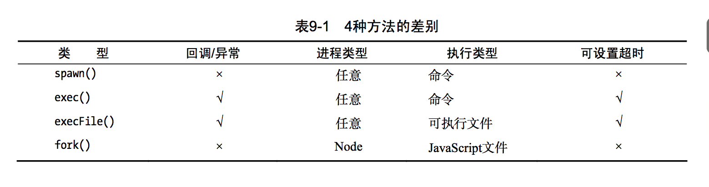

虽然说以前node常见的require作为commonJS的产物，正在逐渐被ES6的import所替代，但是还需要了解一些简单的关于node中的模块机制。首选，我按`node-interview`中的建议去读了下Node关于Module的[文档](https://nodejs.org/dist/latest-v6.x/docs/api/modules.html)。

## `module.export`和`export`的区别
三个知识点:
- `module.export`的初始值为一个空对象{}
- exports是指向的module.exports的引用，requre返回的是node.exports，而不是exports。这就像和下面的例子，直接给对象赋值会改变他的指向，而添加属性方式则不会
- exports其实是module的属性，require则是Module原型的方法。exports.xx=xx，其实跟module.exports.xx=xx其实是一样的，不过如果直接为export赋值，则不能写成exports=xx，而应该写成module.exports=xx，因为exports在这里只是一个引用。

```js
var a = {name: 1};
var b = a;

console.log(a);
console.log(b);

b.name = 2;
console.log(a);
console.log(b);

var b = {name: 3};
console.log(a);
console.log(b);

运行 test.js 结果为：

{ name: 1 }
{ name: 1 }
{ name: 2 }
{ name: 2 }
{ name: 2 }
{ name: 3 }
```
文档上对`module.export`和`export`的使用情况有下面的表示
>If you want the root of your module's export to be a **function (such as a constructor)** or if you want to export a **complete object** in one assignment instead of building it one property at a time, assign it to module.exports instead of exports.


##  `require+模块文件`文件会在第一次声明的时候就运行吗？如果出现相互引用怎么解决?

和ES6不同，当require第一次声明的时候就会运行所有模块内的代码。那么如果`main`引用a和b，但是a引用b，b引用a，形成一个循环的时候怎么办？答案是：
>When main.js loads a.js, then a.js in turn loads b.js. At that point, b.js tries to load a.js. **In order to prevent an infinite loop, an unfinished copy of the a.js exports object is returned to the b.js module**. b.js then finishes loading, and its exports object is provided to the a.js module.

也就是说两个文件相互引用时候不会造成死循环，先执行的导出空对象, 模块在导出的只是 var module = { exports: {} }; 中的 exports, 以从 a.js 启动为例, a.js 还没执行完 exports 就是 {} 在 b.js 的开头拿到的就是 {} 而已


##  `require`缓存机制

对于每一个文件，每次在第一次运行的时候就会cached住运行结果，所以对于连续的`require()`其实会返回相同的object。这一点特性在循环require的时候非常重要，因为能缓存部分执行的结果，所以不会造成死循环。

如果需要多次require时运行不同的结果，则可以考虑export一个函数。

## 省略的路径和文件类型
一般来说，当找不到确切符合文件名的文件后，Node会依次按`.js`，`.json`,`.node`来寻找文件。

当文件路径不以`'/', '../', or './',`开始时，会去当前路径到`node_module`一直到最外层路径的`node_module`文件夹去寻找。
例如，当前脚本文件 /home/ry/projects/foo.js 执行了 require('bar') ，这属于上面的第三种情况。Node 搜索路径如下。
```js
/home/ry/projects/node_modules/bar
/home/ry/node_modules/bar
/home/node_modules/bar
/node_modules/bar
```

## require的实现原理
`require()`这个神奇函数的实现原理都在Node的核心模块，`module.js`中。需要了解`module.require`，我们需要分析一下他的源头，`Module._load`。因为`module.require`就是`Module._load`简单包裹一下后的实现。结合我们前面分析的，让我们先简单形式化表示一下`Module._load`：
```js
Module._load = function(request, parent, isMain) {
  // 1\. 检查 Module._cache 是否有缓存
  // 2\. 如果没有缓存则创建一个新的模块实例
  // 3\. 将模块实例保存到缓存中
  // 4\. 通过给予的filename去调用module.load()，然后调用module.compile()去读取文件内容
  // 5\. 如果文件的载入和解析过程中发生错误，删除缓存中的该模块
  // 6\. 返回 module.exports
};
```
可以看出，`Module._load`是一个负责新模块的加载和管理模块缓存的函数。缓存所有加载过的模块可以减少文件的重复加载并且明显地加快你的应用。

如果一个模块不存在在缓存中，`Module._load `会为这个文件创建一个新的基础模块。`Module._load`会通知模块去读取新的文件的内容，然后把内容送到`module._compile`，`module._compile`的形式化表述如下：

```js
Module.prototype._compile = function(content, filename) {
  // 1\. 创建一个独立的require函数，该函数可以调用module.require。
  // 2\. 给require加上其他帮助性的函数Attach other helper methods to require.
  // 3\. 将代码包裹在一个函数中，并提供了require，module等变量在模块作用域中。
  // 4\. 运行这个函数
};
```

一旦require完成了，整个加载好的源码会被包裹在一个新的函数里面，同时传入require, module, exports和其对外的变量作为新函数的参数。这样就创造了一个新的函数作用域，这样可以避免污染Node的全局环境。

```js
(function (exports, require, module, __filename, __dirname) {
  // 你的代码会被放在这里
});

```

最后，这个包含了模块的函数会被运行。整个`Module._compile`方法的执行时同步的，所以`Module._load`会等待`Module._compile`执行完，然后会返回`module.exports`给用户。

##  AMD, CMD, CommonJS 三者的区别
- `AMD`用在浏览器端，是 `RequireJS`在推广过程中对模块定义的规范化产出。
- `CMD`用在浏览器端， 是 `SeaJS `在推广过程中对模块定义的规范化产出。
- `CommonJS`， Modules/2.0 规范，是服务器端模块的规范，Node.js采用了这个规范。


## 热更新的实现
>在 Node.js 中做热更新代码, 牵扯到的知识点可能主要是 require 会有一个 cache, 有这个 cache 在, 即使你更新了 .js 文件, 在代码中再次 require 还是会拿到之前的编译好缓存在 v8 内存 (code space) 中的的旧代码. 但是如果只是单纯的清除掉 require 中的 cache, 再次 require 确实能拿到新的代码, 但是这时候很容易碰到各地维持旧的引用依旧跑的旧的代码的问题. 如果还要继续推行这种热更新代码的话, 可能要推翻当前的架构, 从头开始从新设计一下目前的框架

有时间可以简单研究一下这个
[一个简单的热更新实现](https://github.com/rayosu/hot-require)

## 关于Promise
首先要清楚的是，Promise是一个对象。Promise对象只有三种状态：
-  异步操作“已完成”（pending）
-  异步操作”已完成“ （resolved）
-  异步操作”失败” （rejected）


这些状态只有两种变化：
- 异步操作成功，Promise对象传回一个值，状态变为resolved。
- 异步操作失败，Promise对象抛出一个错误，状态变为rejected。

Promise对象使用then方法添加回调函数。then方法可以接受两个回调函数，第一个是异步操作成功时（变为resolved状态）时的回调函数，第二个是异步操作失败（变为rejected）时的回调函数（可以省略）。一旦状态改变，就调用相应的回调函数。
除此之外，也可以用catch去捕获promise任何阶段发生的错误。
```js
// po是一个Promise对象
po.then(
  console.log,
  console.error
);

// catch返回
po.then(
  console.log
).catch(
  console.error
);
```

**那么then和catch的不同之处是什么？** 我们用下面这个例子来举例，
```js
//next函数只会处理getData中的reject时的异常情况。
auto.getData().then(function (results) {
     res.send(results);
}, next);
//catch会捕捉到在它之前的promise链上的代码抛出的异常,不仅getData，还包括then()里面
auto.getData().then(function (results) {
     res.send(results);
}).catch(next);
```

最后，用一个以promise实现的`AJAX`来再次巩固一下`promise`的用法。
```js

function getUrl(url) {
  const xhr = new XMLHttpRequest();
  let promise = new Promise((resolve, reject) => {
      xhr.open('GET',url, true);
      xhr.onload = (e) =>{
        if (this.status === 200) {
          const result = JSON.parse(this.responseText);
          resolve(result);
        }
      };
      xhr.onerror = (e) => reject(e);
      xhr.send();
  })
 return promise;
}

getUrl("www.baidu.com").then((data) =>{
  console.log('success',data);
}).catch( error => console.log('error',error))


```

## Node的非阻塞单线程I/O操作实现的原理？

在学习Node的过程中，一直有很多问题没有完全理解，比如为什么在浏览器端执行的Javascript可以突然间与操作系统进行底层的交互？
到底Node是多线程还是单线程？Node的回调机制又是如何实现的？

要想真正理解这些问题，首先需要了解的就是Node的结构。

### Node结构


上图中我们可以清晰的看出，Node的结构分为三层：

- Node.js 核心标准库，这部分是js编写，是一些能直接使用的API
- Node bingdings 是js与底层C/C++实现沟通的关键部分
- Node.js运行的真正关键，由C\C++实现
  - v8： js引擎，这就是为什么Node能运行js的关键
  - Libuv： 为Node提供了跨平台，线程池，事件池，异步I\O等能力,是Node.js 关键的一个组成部分，它为上层的 Node.js 提供了统一的 API 调用，使其不用考虑平台差距，隐藏了底层实现。
  - C-ares：提供了异步处理 DNS 相关的能力。
  - http_parser、OpenSSL、zlib 等：提供包括 http 解析、SSL、数据压缩等其他的能力。

通过这个结构解析，也就更能理解为什么说Node是一个平台而不是一个语言，node的底层是通过c++/c实现，然后由node-binding和v8引擎从而实现js的各种操作。

那回到我们最初的问题，Node是如何实现一个非阻塞异步I\O操作的。我们举一个最简单的文件模块的例子：

```js
var fs = require('fs');
fs.open('./test.txt', "w", function(err, fd) {
	//..do something
});
```
这段代码在node中调用过程可大致描述为:
```
lib/fs.js → src/node_file.cc → uv_fs
```
当我们调用 fs.open 时，Node.js 通过 process.binding 调用 C/C++ 层面的 Open 函数，然后通过它调用 Libuv 中的具体方法 uv_fs_open，最后执行的结果通过回调的方式传回，完成流程。

### 异步、非阻塞 I/O
也就是说，fs.open真正进行系统调用的是Libuv，是他负责所有I/O操作。所以，当我们将 I/O 操作的请求传达给 Libuv 之后，Libuv 开启线程来执行这次 I/O 调用，并在执行完成后，传回给 Javascript 进行后续处理。
每一个异步I/O操作可以由以下两部完成：
#### 发起I/O调用

- 用户通过 Javascript 代码调用 Node 核心模块，将参数和回调函数传入到核心模块；

- Node 核心模块会将传入的参数和回调函数封装成一个请求对象；

- 将这个请求对象推入到 I/O 线程池等待执行；

- Javascript 发起的异步调用结束，Javascript 线程继续执行后续操作
#### 执行回调
- I/O 操作完成后，会将结果储存到请求对象的 result 属性上，并发出操作完成的通知；

- 每次事件循环时会检查是否有完成的 I/O 操作，如果有就将请求对象加入到 I/O 观察者队列中，之后当做事件处理；

- 处理 I/O 观察者事件时，会取出之前封装在请求对象中的回调函数，执行这个回调函数，并将 result 当参数，以完成 Javascript 回调的目的。

线程池的模拟异步操作如下图所示；


从这里，我们可以看到，我们其实对 Node.js 的单线程一直有个误会。事实上，它的单线程指的是自身 Javascript 运行环境的单线程，Node.js 并没有给 Javascript 执行时创建新线程的能力，最终的实际操作，还是通过 Libuv 以及它的事件循环来执行的。这也就是为什么 Javascript 一个单线程的语言，能在 Node.js 里面实现异步操作的原因，两者并不冲突。

### 非I/O的异步操作
在Node中，除了大部分异步I/O操作，其实还有一些与I/O无关的异步操作。主要包括这四个
- setTimeOut()
- setInterval()
- setImmediate()
- process.nextTick()

这其中，setTimeout和setInterval的作用与在浏览器中基本相同，这里不用多说，而setImmediate和process.nextTick其实和setTimeout的0秒后执行效果一样，
```js
setTimeout(function () { // TODO
}, 0);
```
为什么用process.nextTick和setImmediate是因为`setTimeout(fn, 0)`的方式比较浪费性能。而`process.nextTick()`更加高效。
需要注意的是，process.nextTick()中的优先级要高于setImmediate()。


## Node创建多进程？

为了能够充分利用多核CPU的特性，Node提供了node.child_process模块用来随意创建子进程的能力。一般有四个方法去创建子进程：

- spawn()
- exec()/execFile()
- fork()

### spawn
`spawn(command, args, options) `适合用在进程的输入、输出数据量比较大的情况（因为它支持以 stream 的使用方式），可以用于任何命令。
```js
// child.js
console.log('child argv: ', process.argv);
process.stdin.pipe(process.stdout);

// parent.js
const p = child_process.spawn(
  'node', // 需要执行的命令
  ['child.js', 'a', 'b'], // 传递的参数
  {}
);
console.log('child pid:', p.pid);
p.on('exit', code => {
  console.log('exit:', code);
});

// 父进程的输入直接 pipe 给子进程（子进程可以通过 process.stdin 拿到）
process.stdin.pipe(p.stdin);

// 子进程的输出 pipe 给父进程的输出
p.stdout.pipe(process.stdout);
/* 或者通过监听 data 事件来获取结果
var all = '';
p.stdout.on('data', data => {
    all += data;
});
p.stdout.on('close', code => {
    console.log('close:', code);
    console.log('data:', all);
});
*/
```

### exec/execFile
`exec(command, options, callback)` 和 `execFile(file, args, options, callback)` 比较类似，会使用一个 Buffer 来存储进程执行后的标准输出结果，可以一次性在 callback 里面获取到。不太适合输出数据量大的场景。

### fork
fork(modulePath, args, options) 实际上是 spawn 的一个“特例”，会创建一个新的 V8 实例，新创建的进程只能用来运行 Node 脚本，不能运行其他命令。并且会在父子进程间建立 IPC 通道，从而实现进程间通信。

### 4种方法差别

spawn()与exec()、execFile()不同的是，后两者创建时可以指定timeout属性设置超时时间 ，一旦创建的进程时间超过设定的时间就会被杀死。
exec()与execFile()不同的是，exec()适合执行已有的命令，execFile()适合执行文件。下面看看具体一个调用方式，以下四个方式都会返回子进程对象：

```js
var cp = require('child_process');
cp.spawn('node', ['worker.js']);
cp.exec('node worker.js', function (err, stdout, stderr) {
  // some code
});
cp.execFile('worker.js', function (err, stdout, stderr) {
  // some code
});
cp.fork('./worker.js');
```



### 进程间通信

实现进程间通信的方法的有很多， 如`命名管道`，`匿名管道`，`socket`，`信号量`，`共享内存`，`消息队列`等。Node中实现通信IPC通道的方式管道。

实际上默认情况下，只有 fork 出的子进程才能和父进程收发消息，因为 fork 会建立父子进程的 IPC 通道，其他方法并不会建立这种通道。

```js
// child.js
console.log('child argv: ', process.argv);
process.on('message', m => {
  console.log('message in child:', m);
});
setTimeout(() => {
  process.send('send from child');
}, 2000);

// parent.js
const p = child_process.fork(
  'child.js', ['a', 'b'],
  {}
);
console.log('child pid:', p.pid);

p.on('exit', code => {
  console.log('exit:', code);
});
p.on('message', m => {
  console.log('message from child: ', m);
});
p.send('send from parent');
```


## express框架中为什么要传递next？
因为中间件机制，用来将当前路由传递给下一个中间件。


## 引用：
- [Node Interview - Github](https://github.com/ElemeFE/node-interview)
- [requrie()工作原理-CSDN](http://blog.csdn.net/u012362458/article/details/57405141)
