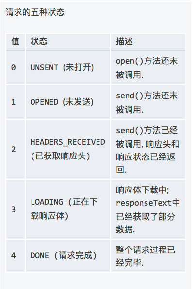

## OSI，TCP/IP，五层协议的体系结构，以及各层协议


- OSI分层 （7层）：
物理层、数据链路层、网络层、传输层、会话层、表示层、应用层。

- TCP/IP分层（4层）：网络接口层、 网际层、运输层、 应用层。

五层协议 （5层）：物理层、数据链路层、网络层、运输层、 应用层。
每一层的协议如下：
- 物理层：RJ45、CLOCK、IEEE802.3 （中继器，集线器）
- 数据链路：PPP、FR、HDLC、VLAN、MAC （网桥，交换机）
- 网络层：IP、ICMP、ARP、RARP、OSPF、IPX、RIP、IGRP、 （路由器）
- 传输层：TCP、UDP、SPX
- 会话层：NFS、SQL、NETBIOS、RPC
- 表示层：JPEG、MPEG、ASII
- 应用层：FTP、DNS、Telnet、SMTP、HTTP、WWW、NFS

每一层的作用如下：
- 物理层：通过媒介传输比特,确定机械及电气规范（比特Bit）
- 数据链路层：将比特组装成帧和点到点的传递（帧Frame）
- 网络层：负责数据包从源到宿的传递和网际互连（包PackeT）
- 传输层：提供端到端的可靠报文传递和错误恢复（段Segment）
- 会话层：建立、管理和终止会话（会话协议数据单元SPDU）
- 表示层：对数据进行翻译、加密和压缩（表示协议数据单元PPDU）
- 应用层：允许访问OSI环境的手段（应用协议数据单元APDU）

## TCP和UDP的区别？
首选要明白TCP/IP协议是网络协议集，里面包括应用层，传输层，网络层。
TCP提供面向连接的、可靠的数据流传输，而UDP提供的是非面向连接的、不可靠的数据流传输。

TCP传输单位称为TCP报文段，UDP传输单位称为用户数据报。
TCP注重数据安全性，UDP数据传输快，因为不需要连接等待，少了许多操作，但是其安全性却一般。
TCP对应的协议和UDP对应的协议

### TCP对应的协议：
- （1） FTP：定义了文件传输协议，使用21端口。
- （2） Telnet：一种用于远程登陆的端口，使用23端口，用户可以以自己的身份远程连接到计算机上，可提供基于DOS模式下的通信服务。
- （3） SMTP：邮件传送协议，用于发送邮件。服务器开放的是25号端口。
- （4） POP3：它是和SMTP对应，POP3用于接收邮件。POP3协议所用的是110端口。
- （5）HTTP：是从Web服务器传输超文本到本地浏览器的传送协议。

### UDP对应的协议：
（1） DNS：用于域名解析服务，将域名地址转换为IP地址。DNS用的是53号端口。
（2） SNMP：简单网络管理协议，使用161号端口，是用来管理网络设备的。由于网络设备很多，无连接的服务就体现出其优势。
（3） TFTP(Trival File Tran敏感词er Protocal)，简单文件传输协议，该协议在熟知端口69上使用UDP服务。


## URI和URL的区别
对于`URI`和`URL`还有其他概念的区别，可以从一张图就清晰获得。


- URI = `Universal Resource Identifier` 统一资源标志符
- URL = `Universal Resource Locator` 统一资源定位符
- URN = `Universal Resource Name` 统一资源名称

URI可以分为URL,URN或同时具备locators 和names特性的一个东西。URN作用就好像一个人的名字，URL就像一个人的地址。换句话说：URN确定了东西的身份，URL提供了找到它的方式。

这些全都是URI, 其中有些是URL：
- `ftp://ftp.is.co.za/rfc/rfc1808.txt`(also a URL because of the protocol)
- `http://www.ietf.org/rfc/rfc2396.txt`(also a URL because of the protocol)
- `ldap://[2001:db8::7]/c=GB?objectClass?one` (also a URL because of the protocol)
- `mailto:John.Doe@example.com` (also a URL because of the protocol)
- `news:comp.infosystems.www.servers.unix` (also a URL because of the protocol)
- `tel:+1-816-555-1212`
- `telnet://192.0.2.16:80/`(also a URL because of the protocol)
- `urn:oasis:names:specification:docbook:dtd:xml:4.1.2`

## HTTP状态码

- **1XX (临时响应)表示临时响应并需要请求者继续执行操作的状态代码.**
  - 100 (继续) 请求者应当继续提出请求。 服务器返回此代码表示已收到请求的第一部分，正在等待其余部分。
  - 101 (切换协议) 请求者已要求服务器切换协议，服务器已确认并准备切换。

- **2XX (成功)表示成功处理了请求的状态代码**
  - 200 (成功) 服务器已成功处理了请求。 通常，这表示服务器提供了请求的网页。
  - 201 (已创建) 请求成功并且服务器创建了新的资源。
  - 202 Accepted 已经接受请求，但处理尚未完成。  
  - 204 No Content 没有新文档，浏览器应该继续显示原来的文档。如果用户定期地刷新页面，而Servlet可以确定用户文档足够新，这个状态代码是很有用的。  

- **3xx (重定向) 表示要完成请求，需要进一步操作。 通常，这些状态代码用来重定向**
  - 300 (多种选择) 针对请求，服务器可执行多种操作。 服务器可根据请求者 (user agent) 选择一项操作，或提供操作列表供请求者选择。
  - 301 `Moved Permanently`
    永久性重定向。该状态码表示请求的资源已经被分配了新的URI，并且以后使用资源现在所指的URI。并且根据请求的方法有不同的处理方式：
    - HEAD: 必须在响应头部Location字段中指明新的永久性的URI。
    - GET: 除了有Location字段以外，还需要在响应体中附上永久性URI的超链接文本。
    - POST: 客户端在发送POST请求，受到301响应之后，不应该自动跳转URI，应当让用户确认跳转。

  - 302 和 303 还有 307：`临时重定向`
  三个状态码都表示临时重定向。那这三个方法有什么区别呢？他们的区别主要在要求客户端如何对待返回的有效url上。
  在http1.0版本中，只有302状态码。302状态码的规定是对于非幂等请求，即post请求，你仍用post方法去访问新返回的url。然而广大浏览器厂商并没有这样实现，因为考虑到客户端那边的执行环境可能已经发生变化，他们把post方法全都变成了get请求。
  既然出现了这种协议规定和现实不符合的情况，http1.1就必须得纠正这个做法了。为了往下兼容，简化设计，http1.1就在老版本上更新，添加了303和307状态码，他们的意义如下：
    - 303用来表示对于post请求，变成get方法来访问新返回的url，和302的实际情况相同
    - 307用来表示对于post请求，还是按post方法来访问新返回的url，和302所规定的一样
    - 304 `Not Modified`

  该状态码表示客户端发送附带条件请求时，服务器端允许请求访问资源，但未满足条件的情况，多数运用在返回缓存的情况。304状态码返回时，不包含任何响应的主题部分。附带条件的请求指的是采用GET方法的请求头中包含：If-Match、If-Modified-Since、If-None-Match、If-Range、If-Unmodified-Since中任一首部。

    - 305 `使用代理`

  请求者只能使用代理访问请求的网页。 如果服务器返回此响应，还表示请求者应使用代理。


- **4xx(请求错误) 这些状态代码表示请求可能出错，妨碍了服务器的处理**
  - 400 (错误请求) 服务器不理解请求的语法。

  - 401 (未授权) 请求要求身份验证。 对于需要登录的网页，服务器可能返回此响应。

  - 403 (禁止) 服务器拒绝请求。

  - 404 (未找到) 服务器找不到请求的网页。

- **5xx(服务器错误)这些状态代码表示服务器在尝试处理请求时发生内部错误。 这些错误可能是服务器本身的错误，而不是请求出错**
  - 500 (服务器内部错误) 服务器遇到错误，无法完成请求。

  - 501 (尚未实施) 服务器不具备完成请求的功能。 例如，服务器无法识别请求方法时可能会返回此代码。

  - 502 (错误网关) 服务器作为网关或代理，从上游服务器收到无效响应。

  - 503 (服务不可用) 服务器目前无法使用(由于超载或停机维护)。 通常，这只是暂时状态。

  - 504 (网关超时) 服务器作为网关或代理，但是没有及时从上游服务器收到请求。

  - 505 (HTTP 版本不受支持) 服务器不支持请求中所用的 HTTP 协议版本。


## 如何实现的会话的跟踪
- 隐藏表单域

隐藏表单域一般是在表单提交时在JSP中声明一个隐藏域，可携带数据到表单提交后的页面。如下：
   <input type="hidden" name="token"
  value="<%=session.getAttribute("token")
  %>">
- 保存cookies

Http是无状态协议，cookie是客户端保存用户会话数据，用于保存用户会话记录。
- url重写

当客户端浏览器禁用cookie时，只有采用URL复写的方式将sessionId携带在URL的末尾来保存会话记录。
- session机制

session是服务端保存用户数据，生成Session时会默认设置一个cookie值为sessionId的cookie保存到客户端

## 三次挥手和四次挥手的状态改变
需要彻底了解三次挥手，我们需要首先对TCP报文研究透彻。


满满的当年计算机网络课程回忆啊，怪自己当时没有好好理解，如今又得再来一遍。好了，废话不多说，让我们来好好分析一个这个图：

- **Source Port和 Destination Port**  表示源端口号和目标端口号，分别占用16位，用去区别主机中不同进程。

- **Subsequence Number:** 就是我们后面要用到SEQ，表示发送端到收送端的数据字节流，表示在这个报文段中的的第一个数据字节在数据流中的序号；主要用来解决网络报乱序的问题；

- **Acknowledgment Number:** 即后面我们用到的ACK，32位确认序列号。这个ack应该是上次收到的seq+1。不过有个很重要的点是当前的ACK序列号必须在标志位中ACK标志为1时才有效。主要用来解决数据不丢包的问题。

- **Offset**：给出首部中32 bit字的数目。需要这个值是因为任选字段的长度是可变的。这个字段占4bit（最多能表示15个32bit的的字，即4*15=60个字节的首部长度），因此TCP最多有60字节的首部。然而，没有任选字段，正常的长度是20字节；

- **TCP Flags:** TCP首部中有6个标志比特，它们中的多个可同时被设置为1，主要是用于操控TCP的状态机，依次为URG，ACK，PSH，RST，SYN，FIN

  - URG: 表示TCP包的紧急指针域有效，用来保证TCP连接不被中断
  - ACK：表示前面的ACK数据有效
  - PSH：表示PUSH操作，指在数据包到达接收端以后，立即传送给应用程序，而不是在缓冲区中排队；
  - RST：表示连接复位请求。用来复位那些产生错误的连接
  - SYN：表示同步序号，用来建立连接。SYN标志位和ACK标志位搭配使用，当连接请求的时候，SYN=1，ACK=0；连接被响应的时候，SYN=1，ACK=1；
  - FIN： 表示发送端已经达到数据末尾，也就是说双方的数据传送完成，没有数据可以传送了，发送FIN标志位的TCP数据包后，连接将被断开。


### 三次握手

好了，有了以上的基础，看懂下面的三次握手示意图并真正理解就不是什么难事了。


- 第一次握手： Client发起建立连接，tcp进程运行connect()，发送SYN标志位1，seq=x的报文段，client状态变成SYN_SENT
- 第二次握手： Server收到连接请求，检查端口是否可用，如果可用就去分配进程，并将自己的SYN置为1，另ack=x+1,seq=y的报文段发送出去，server的状态变成SYN_RCVD
- 第三次握手： Client收到服务器响应，并设置ACK为y+1的TCP包再次发送给server，发送后server和client改变自己的状态为Established，此时三次握手完毕，连接建立。

### 四次挥手

让我们再根据上一个图来看看四次挥手的过程。
- 第一次挥手：主机h1(可以是client端也可以是server端)，运行close(),发起关闭请求，设置FIN为1，发送一个seq = x+2，ack = y+1的FIN报文段，然后主机进入FIN_WAIT_1阶段，表示没有数据再发送。

- 第二次挥手：主机h2收到了关闭请求，设置ack = x+3，表示我同意的你关闭请求，然后主机1收到进入FIN_WAIT_2阶段。
- 第三次挥手：主机2向主机1发送FIN报文段，请求关闭连接，同时主机2进入LAST_ACK状态；
- 第四次挥手：主机1收到主机2发送的FIN报文段，向主机2发送ACK报文段，然后主机1进入TIME_WAIT状态；主机2收到主机1的ACK报文段以后，就关闭连接；此时，主机1等待2MSL后依然没有收到回复，则证明Server端已正常关闭，那好，主机1也可以关闭连接了。

### 为什么？

三次握手很好理解，就是为了不让服务器浪费资源，假设只有两次握手，在第二次握手的时候就建立了连接，可是客户端却一直没有发送数据，那服务器不是一直只能干等吗？简而言之，就是防止资源浪费。

四次握手也许稍微会多想。其实也很简单，TCP是面向连接的，而且是双分工的，就是说服务器和主机都可以发送和接受数据。这就意味着，当主机1发出FIN报文段时，只是表示主机1已经没有数据要发送了，主机1告诉主机2，它的数据已经全部发送完毕了；

但是，这个时候主机1还是可以接受来自主机2的数据；当主机2返回ACK报文段时，表示它已经知道主机1没有数据发送了，但是主机2还是可以发送数据到主机1的；

当主机2也发送了FIN报文段时，这个时候就表示主机2也没有数据要发送了，就会告诉主机1，我也没有数据要发送了，之后彼此就会愉快的中断这次TCP连接。如果要正确的理解四次分手的原理，就需要了解四次分手过程中的状态变化。


## http和https的区别
https和http相比多了一个s，这个s就是security。在http中，数据接受和发送都是明文的，也就是有人如果用抓包工具去分析的你发送的包，是可以分析出来你的具体信息的。而https是在tcp协议的基础上增加了TLS和SSL安全协议。那https又是怎么做到这个安全的呢？ 让我们来剖析一下关于s背后的故事

### https验证流程

首先，https在 **完成TCP握手之后**，在真正发送请求数据前，先会与服务器再增加TLS握手，以证明相互的身份，主要步骤可以从下图看出：


让我们来看着图，梳理下几个关键步骤：

### 第1步 Client Hello
- 传输类型： 明文传输

- 传输内容：
   - 支持的TLS协议版本
   - 自身支持的一系列Cipher Suite（密钥算法套件，简称Cipher），用于后续密钥的生成
   - 支持的hash压缩算法，用于后续的信息压缩传输
   - 生成的随机数`Random1`，用于后续密钥的生成

### 第2，3步  Server Hello + Server Certificate + Server Hello Done：
- 传输类型： 明文传输
- 传输内容：
  - 接收到客户端所有的Cipher后与自身支持的对比，如果不支持则连接断开，否则返回协商的信息结果，包括选择使用的协议版本，加密套件，压缩算法
  - 返回自己的证书，证书中包含了`公钥 颁证机构`,`域名`,`失效日期`
  - 返回服务端生成的另一份随机数`Random2`,注意，至此客户端和服务端都拥有了两个随机数（Random1+ Random2），这两个随机数会在后续生成对称秘钥时用到。

### 第4步 Certificate 验证证书的合法性
- 验证方式：非对称加密验证
- 验证内容：
  - 证书是否可信，发行服务器证书的CA是否可靠
  - 证书是否吊销
  - 证书是否过期
  - 域名是否匹配，核查证书域名与当前的访问域名是否匹配

  证书验证通过后，在浏览器的地址栏会加上一把小锁，如果不通过，会让用户自己做出选择是否信任。

### 第5步 Client Key Exchange：
- 完成工作：
  - 客户端会生成一串随机数`Random3`，然后用证书中的公钥加密, 生成`preMaster key`
  - 生成协商密钥，客户端用两个明文随机数`Random1`和`Random2`与自己计算生成的`Pre-master`计算得到协商密钥`session secret`
  - hash压缩，结合之前所有通信参数的 hash 值与其它相关信息生成一段数据，采用协商密钥 `session_secret`与算法进行加密，生成`encrypted_handshake_message`

- 传输内容：
  - `preMaster key`
  - `change_cipher_spec`，客户端通知服务器后续的通信都采用协商的通信密钥和加密算法进行加密通信
  - `encrypted_handshake_message`

- 传输类型： 加密传输，非对称加密

### 第6， 7步 Change Cipher Spec + Encrypted Handshake Message + Server Finish：

- 完成工作：
  - 服务端拿到客户端传来的密文，用自己的私钥来解密握手消息取出`Pre-master`，基于之前交换的两个明文随机数`random1`和`random2`，计算得到协商密钥:`session secret=Fuc(random1, random2, Pre-Master)`

  - 计算之前所有接收信息的hash值，然后解密客户端发送的`encrypted_handshake_message`，验证数据和密钥正确性

- 传输内容：
  - `change_cipher_spec`, 验证通过之后，服务器同样发送 `change_cipher_spec`以告知客户端后续的通信都采用协商的密钥与算法进行加密通信
  - `encrypted_handshake_message`, 服务器也结合所有当前的通信hash参数信息生成一段数据并采用协商密钥`session secret`与算法加密并发送到客户端

- 传输类型：加密传输，对称加密

### 第8步：Client Finish ###
  - 所作操作：
    - 客户端计算所有接收信息的hash值，并采用协商密钥解密encrypted_handshake_message，验证服务器发送的数据和密钥，验证通过则握手完成

    - 开始使用协商密钥与算法进行对称加密通信，因为这串密钥只有客户端和服务端知道，所以即使中间请求被拦截也是没法解密数据的，以此保证了通信的安全

### 各种加密算法的使用 ：

- 非对称加密算法：RSA，DSA/DSS     在客户端与服务端相互验证的过程中用的是非对称加密
- 对称加密算法：AES，RC4，3DES     客户端与服务端相互验证通过后，以随机数作为密钥时，就是对称加密
- HASH算法：MD5，SHA1，SHA256  在确认握手消息没有被篡改时


## 怎么理解RESTful架构？

简单的说, RESTful 是把每个 URI 当做资源 (Resources), 通过 method 作为动词来对资源做不同的动作, 然后服务器返回 status 来得知资源状态的变化 (State Transfer);

## 不同HTTP方法的比较

### GET和HED的区别

HEAD和GET类似，但不同的是服务器在响应值中返回首部，不返回实体的主体部分。

### GET和POST的区别

虽然有些时候get能做的事情或许post也能做，但是从HTTP规范来说，GET用于信息获取，POST表示可能修改变服务器上的资源的请求。除此之外，如果从一些细节考虑，两者还有如下区别：
  1. 两个传输数据的方式不同
GET请求的数据会附在URL之后（就是把数据放置在HTTP协议头中），**以`?`分割URL和传输数据，参数之间以`&`相连**。如果数据是英文字母或者数字，原样发送，如果是空格，转换为+，如果是中文/其他字符，则直接把字符串用BASE64加密。POST把提交的数据则放置在是HTTP包的包体中。

2. GET方式提交的数据最多只能是1024字节（因为有些操作系统或浏览器对URL长度的限制），理论上POST没有限制（后端可调节）。

3. POST的安全性要比GET的安全性高(如果通过GET提交数据，用户名和密码将明文出现在URL上)

### PUT和POST的区别

POST 是新建 (create) 资源, 非幂等, 同一个请求如果重复 POST 会新建多个资源. PUT 是 Update/Replace, 幂等, 同一个 PUT 请求重复操作会得到同样的结果.

### OPTIOS
请求web服务器告知其支持的各种功能，可以查询服务器支持哪些方法或者对某些特殊资源支持哪些方法。

### TRACE
用于检测

## 谈谈浏览器的同源策略

首先来解释一下同源，同源需同时满足下面三个条件，缺一不可：

- 同域名
- 同端口
- 同协议

因为`www.baidu.com`和`baidu.com`属于不同的域名，所以两者可以判定为不同源。

同源策略本是为了保护用户信息安全来设定，但在开发中，也造成了一定的不便。具体的影响在下面的三个方面：

1. Cookie、LocalStorage 和 IndexDB 无法读取。

2.  DOM 无法获得。

3.  AJAX 请求不能发送。

这里面发生情况比较多的可能是第三点，但是前两点我们也不能忽视。

对于上面的影响，我们分别来谈谈解决对策。

### 一级域名相同的通信

首先我们来看看如果两个网页一级域名相同，二级域名不同，该如何通信数据，比如说cookie？

浏览器在这里帮我们了一个大忙，对于这种情况，我们可以通过设置`document.domain`来共享 Cookie或者其他数据。
举例来说，A网页是`http://hr.163.com/a.html`，
B网页是`http://study.163.com/b.html`。
主要设置相同的document.domain，两个网页就可以共享Cookie(注意必须两个页面同事需要设置，即使B网页是`http://163.com`)
```js
document.domain = '163.com';
```
然后在a网页设置cookie：
```js
document.cookie = "test1=hello";
```
就可以在b网页读到这个cookie了:
```js
var allCookie = document.cookie;
```
除此之外，服务器也可以在设置Cookie的时候，指定Cookie的所属域名为一级域名。

```js
Set-Cookie: key=value; domain=.163.com; path=/
```
当然，除了cookie之外，我们还能通过设置`document.domain`并配合iframe的方法来进行数据传递。
只要设置了同源了后，通过在网页中嵌入iframe，我们可以从父窗口获取子窗口内容，或者子窗口获取父窗口内容。
```js
//父窗口获取子窗口
document.getElementById("myIFrame").contentWindow.document
// 子窗口获取父窗口
window.parent.document.body
```

### 域名完全不同的通信
那另外一种情况，就是域名完全不同的时候怎么获得cookie，这也是腾讯面试中被问到的一个问题。

如果是完全不同原单 网站，目前有三种办法，可以解决跨域窗口的通信问题。

1. 片段标识符
2. window.name
3. 跨文档通信API

#### 片段标识符

片段标示符是URL的#后面的部分，比如
`http://a.com/b.html#fragment`的`#fragment`，如果只是改变片段标示符，页面不会重新刷新。
所以父窗口可以通过把信息写入子窗口的片段标识符，子窗口在通过监听`hashchange`来进行消息传递：

```js
// http://parent.com/a.html
var src = originURL + '#' + data;
document.getElementById('myIFrame').src = src;

//in child iframe page
window.onhashchange = checkMessage;
function checkMessage() {
  var message = window.location.hash;
  // ...
}
```
同样的，子页面也可以改变父窗口的片段标识符。
```js
parent.location.href= target + "#" + hash;
```

然而这个方法有很多的弊端，一是会将数据暴露，另外只能传输很小的字段名。

#### Window.name
浏览器窗口有window.name属性，这个属性最大的特点是，无论是否同源，只要在同一个窗口里，前一个页面设置了这个属性，后一个网页可以读取它。
尝试在浏览器打开百度baidu.com，然后在控制台输入window.name='aaa';回车，接着在地址栏输入qq.com转到腾讯首页，打开控制台输入window.name查看它的值，可以看到输出了"aaa"。

所以我们可以通过这个方法，通过iframe来做信使，载入一个想要通信但是不同源的页面，然后再让iframe的src变成与主窗口同域的地址，这样就可以访问iframe的`window.name`了，并获得想要的属性了。

看下面的例子,我们想在页面`a.com/a.html`获得`b.com/b.html`的数据:

```html
<!-- b.com/b.html -->
<script>
   window.name = "将你想要获取的数据放入window.cookie中";
</script>
```
```html
<!-- a.com/a.html -->
<script>
var ifr = document.createElement('iframe');
var data;
ifr.style.display = 'none';
ifr.src = "b.com/b.html";
document.body.appendChild(ifr);

//iframe载入`b.com/b.html`后立即执行
ifr.onload = function() {
    // 跳回和主窗口a.com相同的域
    ifr.src = 'about:black'; //设置about：black可以达到同域的效果 也可以节省资源
    ifr.onload = function() {
      data = iframe.contentWindow.name;
      console.log('成功获取到数据',data);
    }  
}
</script>
```
`window.name`可以传输最多2MB的内容，但是只能以字符串的形式传递。不过总体上来说，这是一个比较实用的获取不同域的方法。

### window.postMessage

`window.postMessage`是html5新引进的的特性，可以使用它来向其它的window对象发送消息，无论这个window对象是属于同源或不同源。

调用postMessage方法的window对象是指要接收消息的那一个window对象，该方法的第一个参数message为要发送的消息，类型只能为字符串；第二个参数targetOrigin用来限定接收消息的那个window对象所在的域，如果不想限定域，可以使用通配符`*`  。

需要接收消息的window对象，可是通过监听自身的message事件来获取传过来的消息，消息内容储存在该事件对象的data属性中。

同样的，我们用`window.postMessage`来模拟一下刚才的在页面`a.com\a.html`获取`b.com\b.html`中的data
```html
<!-- b.com/b.html -->
<iframe id="ifr" src="http://a.com/a.html"></iframe>
<script>
  window.onload = function() {
      var data = "需要发送的数据";
      var ifr = document.querySelector('#ifr');
      var targetOrigin = 'http://a.com/a.html';
      ifr.contentWindow.postMessage(data, targetOrigin);
  }
  // b页面也可以收到a页面的消息
  window.addEventListener('message', function(e) {
    console.log('a say: '+e.data);
  }, false);
</script>

<!-- a.com/a.html -->
<script>
  window.addEventListener('message', function(e) {
        var data = e.data;
        console.log('从b.com接收到的消息:', data);
        e.source.postMessage('这是来自a的消息', '*');
    });
</script>
```
除了这类通信以外，我们可能还经常需要实现跨域间的AJAX通信。对于常用Ajax请求，我们有如下的办法：
### JSONP

虽然说浏览器里有着同源策略，但是聪明的你一定发现也有特殊情况。是的，在带有src属性的html标签中，如`script`,`link`,`img`，是不遵循同源限制的。所以JSONP就是巧妙的利用js在DOM中动态生成scritp元素，并将数据以回调函数的形式发送出去，来实现了不同源的ajax请求发送。具体的代码如图；

```js
function jsonpHandler(req) {
  var element = document.createElement('script');
  element.setAttribute("type","text/javascript");
  element.setAttribute("src",req.url + '?callback=' + req.callback));
  document.body.appendChild(element);
}

function hello(res){
    alert('hello ' + res.data);
}

//use jsonpHandler
jsonpHandler({
  url：'www.baidu.com',
  callback: hello,
})
```
通过这个简单的示例，也应该可以看出来jsonp有一个明显的不足，那就是只能用于get请求。为了满足各类http方法，W3C协议又出了个新的规范

### CORS协议

首先要明确一点就是，CORS需要浏览器和服务器同时支持。整个CORS通信过程，都是浏览器自动完成，不需要用户参与。此，实现CORS通信的关键是服务器。只要服务器实现了CORS接口，就可以跨源通信。

CORS协议把请求分为了两类，一类是简单请求，一类的是非简单请求，两者的处理方式是不同的，一般来说，简单请求需要同时满足以下两大条件：
- 请求方法是以下三种： HEAD，GET， POST
- 头信息不超出以下几种字段：
    - Accept
    - Accept-Language
    - Content-Language
    - Last-Event-ID
    - Content-Type

#### 简单请求
对于简单请求的处理，就是浏览器会自动在头信息之中增加一个`Origin`字段，然后发送出去。
然后如果`Origin`指定的源不在许可范围内，服务器会返回一个正常的HTTP回应。浏览器发现回应的信息里没有包含`Access-Control-Allow-Origin`字段，就会配出一个错误，然后被`XMLHttpRequest`的`onerror`回调函数捕获。一般来说，这样的错误无法通过状态码识别。

如果`Origin`指定的域名在许可范围内，服务器返回的响应会多出几个头信息字段
```json
Access-Control-Allow-Origin: http://api.bob.com
Access-Control-Allow-Credentials: true
Access-Control-Expose-Headers: FooBar
Content-Type: text/html; charset=utf-8
```

这几个以Access开头的字段都是什么意思呢？
- `Access-Control-Allow-Origin`: 必须字段，要么是请求的`Origin`字段值，要么是一个`*`
- `Access-Control-Allow-Credentials`:可选字段，表面是否允许发送Cookie，默认为false，即不能发送。为了允许发送，这个值需为`true`,同时开发者在浏览器中Ajax请求中设置`xhr.withCredentials = true;`
- `Access-Control-Expose-Headers`:可选字段，因为CROS简单请求只能拿到6个基本字段，想拿到其他字段就必须在这里指定，上面的例子就是可以返货`FooBar`字段

#### 非简单请求

非简单请求是那种对服务器有特殊要求的请求，比如请求方法是PUT或DELETE，或者Content-Type字段的类型是application/json。

非简单请求的CORS请求，会在正式通信之前，浏览器会增加一次HTTP查询请求，称为"预检"请求（preflight）。
浏览器先询问服务器，当前网页所在的域名是否在服务器的许可名单之中，以及可以使用哪些HTTP动词和头信息字段。只有得到肯定答复，浏览器才会发出正式的XMLHttpRequest请求，否则就报错。

下面是一个浏览器发现是非简单请求后自动发出`预检`头信息
```js
OPTIONS /cors HTTP/1.1
Origin: http://api.bob.com
Access-Control-Request-Method: PUT
Access-Control-Request-Headers: X-Custom-Header
Host: api.alice.com
Accept-Language: en-US
Connection: keep-alive
User-Agent: Mozilla/5.0...
```
服务器收到"预检"请求以后，检查了Origin、Access-Control-Request-Method和Access-Control-Request-Headers字段以后，确认允许跨源请求，就可以做出回应。

```js

HTTP/1.1 200 OK
Date: Mon, 01 Dec 2008 01:15:39 GMT
Server: Apache/2.0.61 (Unix)
Access-Control-Allow-Origin: http://api.bob.com
Access-Control-Allow-Methods: GET, POST, PUT
Access-Control-Allow-Headers: X-Custom-Header
Content-Type: text/html; charset=utf-8
Content-Encoding: gzip
Content-Length: 0
Keep-Alive: timeout=2, max=100
Connection: Keep-Alive
Content-Type: text/plain
```

如果浏览器否定了"预检"请求，会返回一个正常的HTTP回应，但是没有任何`CORS`相关的头信息字段。这时，浏览器就会认定，服务器不同意预检请求，因此触发一个错误，被XMLHttpRequest对象的`onerror`回调函数捕获。控制台会打印出如下的报错信息。
```
XMLHttpRequest cannot load http://api.alice.com.
Origin http://api.bob.com is not allowed by Access-Control-Allow-Origin.
```

一旦服务器通过了"预检"请求，以后每次浏览器正常的CORS请求，就都跟简单请求一样，会有一个Origin头信息字段。服务器的回应，也都会有一个Access-Control-Allow-Origin头信息字段

## ajax的核心思想
ajax思想的核心在不重新加载页面的情况下，利用js发送http请求，从而达到与服务器通信的目的。那实现过程是什么呢？是通过师兄XMLHttpRequest对象，通过这个xhr对象，可以发送以及接受各种格式的信息，包括json，xml，html，甚至文本文件，而且还可以选择是异步还是同步实现。那如果让我去写一个js的原生ajax请求，也是一个很简单的事情。

### XMLHttpRequest的常用属性和方法
#### 属性：
read only:
- readyState
- response
- responseText
- responseType
- status
- statusText
- upload
- withCredentials

not read only:
- onreadystatechange
- responseType
- timeout

#### 方法
- abort()
- open()
- send()
- getAllResponseHeaders()
- setRequestHeader()

以上的几个方法需要明确具体含义，如果不了解可以上[MDN](https://developer.mozilla.org/en-US/docs/Web/API/XMLHttpRequest)去查询。

尤其是关于readyState的值的变化，从0到4发生的五种变化，需要铭记于心



如果需要将ajax和promise合并使用，只需要一些轻微的改变就可以。


```js
ajax({method:'get',url:'http://localhost:3000'}).then((data) =>{
  console.log('success get data',data);
}).catch((err) => {
  console.log('failed to get data',err);
})

function ajax(data) {
  const url = data.url, method = data.method;
  let promise = new Promise((resolve, reject) => {
    const xhr = new XMLHttpRequest();
    xhr.open(method, url, true);
    xhr.onreadystatechange = function() {
      if(xhr.readyState === 4) {
        if(xhr.status === 200) {
        resolve(xhr.responseText);
        }
        else{
          reject(new Error(xhr.statusText));
        }
      }
    };
  })
  return promise
}

```

## Cookie和LocalStorage和SessionStorage区别

### 大小不同

浏览器不能保存超过300个cookie，单个服务器不能超过20个，每个cookie不能超过4k。 localStorage和sessionStorage一般为5MB

## 数据的生命期

Cookie由服务器生成，可以设置失效事件，如果在浏览器端生成Cookie，默认是关闭浏览器后失效。 LocalStorage是除非被清除，否则永久保存。sessionStorage是仅在当前会话下有效，关闭浏览器就会被清除。
### 作用域不同
sessionStorage不在不同的浏览器窗口中共享，即使是同一个页面；localStorage 在所有同源窗口中都是共享的；cookie也是在所有同源窗口中都是共享的。Web Storage 支持事件通知机制，可以将数据更新的通知发送给监听者。Web Storage 的 api 接口使用更方便。
### 访问方式
cookie会在请求时发送到服务器，作为会话标识，服务器可修改cookie；web storage不会发送到服务器，而且cookie有path概念，子路径可以访问父路径cookie，父路径不能访问子路径cookie，localStorage的修改会促发其他文档窗口的update事件，cookie有secure属性要求HTTPS传输

### 什么时候用sessionStorage？
localStorage的使用场景很明确，当你不想把数据放进cookie里每次进行请求传送，当你想更久的保存数据时，你可以用localStorage。但是，什么时候应该用sessionStorage呢？

一般来时说，sessionStorage能更好的用在ajax驱动的动态页面中，可以用sessionStorage保存一些状态。

## Cookie和Session区别？


首先来说说cookie和session，cookie是存储在浏览器上的一小段数据，用来记录某些当页面关闭或者刷新后仍然需要记录的信息。在控制台用 「document.cookie」查看你当前正在浏览的网站的cookie。每次网络请求 Request headers 中都会带上cookie。所以如果 cookie 太多太大对传输效率会有影响。

而session是一个服务器端的概念，用来记录一些用户的状态。当一个用户打开淘宝登录后，刷新浏览器仍然展示登录状态。服务器如何分辨这次发起请求的用户是刚才登录过的用户呢？这里就使用了session保存状态。
- 用户在输入用户名密码提交给服务端，服务端验证通过后会创建一个session用于记录用户的相关信息，这个 session 可保存在服务器内存中，也可保存在数据库中。
- 创建session后，会把关联的session_id 通过setCookie 添加到http响应头部中。
浏览器在加载页面时发现响应头部有 set-cookie字段，就把这个cookie 种到浏览器指定域名下。
- 当下次刷新页面时，发送的请求会带上这条cookie， 服务端在接收到后根据这个session_id来识别用户。

所以说，cookie 是存储在浏览器里的一小段「数据」，而session是一种让服务器能识别某个用户的「机制」，session 在实现的过程中需要使用cookie。 二者不是同一维度的东西。

既然提到了cookie，我们不妨再去多说几句cookie的常见坑。

- 一个set-cookie只能设置一个cookie， 当想要设置多个cookie的时候，需要添加同样多的set-Cookie字段
-  用js设置cookie时，只需用`document.cookie = "name = John"`,如果需要设置多个，不能写在一起
- 修改cookie：要想修改一个cookie，只需要重新赋值就行，旧的值会被新的值覆盖。但要注意一点，在设置新cookie时，path/domain这几个选项一定要旧cookie保持一样。否则不会修改旧值，而是添加了一个新的 cookie。

## HTTP报文分析
HTTP报文分为HTTP请求报文和HTTP响应报文。通常来说，报文由三部分组成：报文首部 + 空行 + 报文主体。
报文首部中，根据报文类型分为两个版本。
- 请求报文： 请求行 + 请求首部字段 + 通用首部字段 + 实体首部字段
- 响应报文： 状态行 + 响应首部字段 + 通用首部字段 + 实体首部字段

下面让我们分别来看看基本的字段名：
### 通用首部字段：
- ##### Cache-Control 指定缓存的工作机制
  - public：其他用户也可以利用缓存
  - private：只以特定的用户作为对象
  - no-cache：防止从缓存中返回过期的资源
  - no-store：不缓存请求或相应的任何内容
  - max-age = [秒]：相应的最大缓存时间
  - max-stale=[秒]：可指缓存资源即使过期也照常接受
  - min-frame=[秒]：要求缓存服务返回至少还未过指定时间的缓存
  - only-if-cached： 从缓存获取资源

- ##### Connection： 逐条首部，连接的管理
  - keep-alive 持久连接（http1.1默认）
  - close 断开链接
- ##### Trailer：事先说明在报文主题后记录了哪些首部字段
- ##### Transfer-Encoding：规定传输报文主体的编码方式
- ##### Via：代理服务器相关信息
- ##### Warning：错误通知
- ##### Pragma：只用在客户端放松的请求中，求所有的中间服务不返回缓存的资源，和cache-control配合使用

### 请求首部字段：
- ##### Accept: 用户处理可处理的媒体信息
- ##### Accept-Charset：优先的字符集
- ##### Accept-Encoding：优先的内容编码
- ##### Accept-Language：优先自然语言
- ##### Authorization： Web认证信息
- ##### Expect：期待服务器的特定行为
- ##### Host：请求资源所在服务器
- ##### If-Match：比较实体标记（ETag）
- ##### If-Node-Match： If-None-Match字段值与ETag值不一样时，可处理该请求
- ##### If-Range：
- ##### If-Modified-Sience：比较资源的更新时间
- ##### Referer：对请求中URI的原始获取方
- ##### User-Agent：HTTP客户端程序的信息
- ##### cookie：客户端的cookie信息

### 响应首部字段：

- ##### Accept-Ranges：是否接受字节范围请求
- ##### Age：能告知客户端，源服务器在多久前创建了相应
- ##### ETag：资源的匹配信息
- ##### Location：令客户端重定向至指定URI，和3XX状态码使用
- ##### Set-Cookie：
    - NAME=VALUE 赋予cookie的名称和其值
    - expires = DATE Cookie的有效期
    - path=PATH 将服务器上的文件目录作为Cookie的使用对象
    - domain=域名   作为Cookie使用对象的域名
    - Secure  尽在HTTPS安全通信时才会发送Cookie
    - HTTPOnly 加以限制, 使Cookie不能被Javascript脚本访问

### 实体首部字段
- ##### Allow 通知客户端能支持的所有HTTP方法
- ##### Content-Langu 告知客户端实体主图使用的自然原因
- ##### Content-Length 表明实体主体部分的大小

## 关于HTTP缓存

缓存的利用是优化网站性能很关键的一步，上面提到的首部字段中很多其实就是为缓存做服务的。所以，让我们来好好探究一下http缓存的利用。

### 缓存分类

首先，我们得清楚浏览器缓存分为 **强缓存** 和 **协商缓存** 两种形式。这两种形式的不同主要体现在以下方面：

- 浏览器在加载资源的时候，会先查询缓存中记录的上次的response header字段中的强缓存字段是否满足需求，如果满足，则浏览器直接从自己的缓存中读取资源，不会发请求到服务器。

- 当首部请求字段里没有命中强缓存的时候，浏览器会发送请求到服务器，这时候服务区端会根据另外一些请求header字段和自身的资源情况来确定是否命中协商缓存，如果命中，服务器端会返回304，告诉客户端可以直接从缓存中加载
资源。

也就是说，无论是强缓存命中还是协商缓存命中，都是从客户端缓存中加载资源，两者的不同就是强缓存不发送请求到服务器，直接利用缓存，而协商缓存需要发送请求到服务器，和服务器进行协商后再确定是否利用缓存。

### 强缓存 Expires和 Cache-Control

强缓存的命中规则主要是利用Expires和Cache-Control这两个字段。

#### Expires
该头部字段会制定一定绝对的过期时间，再这个时间之前，浏览器都不会向服务器去请求。但是因为服务器端时间浏览器时间经常出现不一致的情况，我们基本上不使用这个头部。

#### Cache-Control
它定义了一个文档从第一次生成开始到不再新鲜、无法使用为止的最长使用期，并且以秒为单位。用法如下所示：
```
Cache-Control: max-age=484200
```
这个响应头告诉了浏览器，在第一次响应后的484200秒里，如果再次请求资源时，不需要再次向服务器发起请求，而是直接使用缓存。


1. 首先要明确这两个字段都是来源于浏览器第一次请求成功后的response header中，浏览器在第一次请求成功后会把资源连同`responese header`一起缓存下来。

2. 当浏览器再次请求这个资源时候，会先从缓存中寻找，找到这个资源后，就会扎到expires或者cache-control指定的时间与当前时间进行对比计算，如果在指定时间内，就算命中缓存，如果没有命中，则发送请求，并根据新的响应header去更新。

两者的区别不用多说，因为Cache-Control描述的是一个相对时间，在进行缓存命中的时候，都是利用客户端时间进行判断，所以相比较Expires，Cache-Control的缓存管理更有效，安全一些。

Expires和Cache-Control同时存在时，Cache-Control优先级高于Expires。

### 强缓存的两面性

强缓存是一个优化必备工具，所以通常的做法是为需要缓存的静态资源全部配置一个超长时间的expires或者cache-control。然而这种缓存配置方式会带来一个新问题，就是在发布资源的时候进行资源更新。

这个问题已经有很多比较成熟的解决方案，尤其可以利用一些如webpack一样的构建工具，得到轻松解决。[利用webpack实现资源增量更新](https://zhuanlan.zhihu.com/p/24954527)

此外，强缓存通常是针对静态资源使用，如果动态资源需要引用，比如一些html被缓存的话，等html更新可能就没有合适的机制去通知浏览器这些html有更新了。

### 协商缓存

协商缓存主要是利用的是`【Last-Modified，If-Modified-Since】`和`【ETag、If-None-Match】`这两对Header来管理的。

#### 【Last-Modified，If-Modified-Since】

该头部配合cache-control使用，它标志了资源的最后修改时间，即服务器在响应中回带有一个Last-Modified的头部，告诉浏览器该资源的最后修改时间。

1. 在第一次请求页面时，会通过Cache-control的指示缓存资源，同时会设置资源的Last-Modified时间。

2. 当再一次请求页面的资源时，根据Cache-control:max-age指定的时间，在这个时间期间，每次向服务器获取资源时，会直接获取缓存内容，并且响应码为200 OK(from cache)。

3. 若资源已经过期，则会向服务器发起请求，此时请求中会带上`If-Modified-Since`请求头，值为`Last-Modified`的值。

4. 服务器收到If-Modified-Since的请求头，此时服务器将根据该字段的值与服务器文件改动时间进行一定的逻辑判断。如果资源没有变更，则返回304告知浏览器直接使用缓存。如果资源已经变更，则返回最新的资源，并且响应码为200，还会发送最新的Last-Modified字段。

5. 若响应包中Cache-Control:max-age 或 Expires 字段，则会重新设置缓存的过期时间，于是，浏览器又可以不需要向服务器发起请求了。

#### 【ETag、If-None-Match】

该头部和Last-Modified的作用类似，先来看看它的使用方式。

同样的，在第一次请求页面资源，会缓存页面，设置缓存时间，此时若服务器返回了Etag字段，浏览器则会保存Etag的字段和值。这个值是个特殊串，大概是像这样的值，“x123cef”。
Apache中，ETag的值，默认是对文件的索引节（INode），大小（Size）和最后修改时间（MTime）进行Hash后得到的。当然我们可以更改这种算法，例如使用MD5。

当资源过期时，在对服务器发起的请求头中会带有一个If-None-Match的请求头，值为Etag的值。

服务器收到If-None-Match的值，同样的会将本地资源的校验值和If-None-Match的值进行比对。
相同，说明资源没有更改，返回304。
不同，说明资源已经更改，返回最新资源，响应码为200，并带有最新的Etag值。

若同时使用了Last-Modified和Etag，只要有一方认为资源没有变动，就会进行304响应

#### 两种形式的区别
1. 首先Last-Modified只能精确到秒，有些时候，文件会在1秒内被更改很多次，使用Last-Modified则无法准确的标志文件的更改时间。
2. 有时会定时生成一些文件，但是内容是不变的，或者仅仅修改变动的时间，此时我们并希望浏览器还是使用缓存的资源，Last-Modified则无法满足我们了。
3. Etag是服务器或者开发者生成的一个唯一特殊标志值，可以更加有效的控制缓存。资源变更则更新该值，没有变更则不更新该值，简洁粗暴

所以，一般对于小型网站来说，两者都是同步启用的。但是在分布式系统的场景需要注意不使用Etag，因为每台机器会生成不同的Etag。

## HTTP 2.0 前世今生
任何事物的消退和新生都有其背后推动的力量。所以在研究一个新协议或者技术之前，我们需要先来了解一下这个协议出现的技术背景，即为什么会有这个协议出现的需求。对于HTTP2.0来说，我们自然就要去看看http1.0 和http1.1这个两个兄弟的短板。

### HTPP1.0的短板

因为HTTP的运行是建立在TCP之上的，所以HTTP的协议的瓶颈有很多是基于TCP协议本身的特性，比如TCP建立连接时三次握手有1.5个RTT(`round-`)的延迟，又比如TCP在建立连接的初期有慢启动。所以连接的重用总是比新建连接性能要好。但是对于`http 1.0` 来说，有两个很重要的缺点：
1. **连接无法复用**

即每次请求都会经历三次握手和慢启动。三次握手在高延迟的场景下影响较明显，慢启动则对文件类大请求影响较大。

2.  **`head of line blocking`**
假设现在有5个请求，对于http1.0的实现，在第一个请求没有收到恢复之前，后续的请求只能排队，请求`2,3,4,5`只能等请求`1`的response回应之后才能逐个发出。一旦这个先头部队出现问题，影响的就是后面的大部队。

### HTTP1.1的改进和其他补救办法

对于前面提到的第一个问题，也就是连接无法复用，http1.1之后将http1.0协议就提出的`Connection:Keep-Alive`变成了默认选项，如果要关闭连接复用需要显式的设置`Connection:Close`。一段时间内的连接复用对PC端浏览器的体验帮助很大，因为大部分的请求在集中在一小段时间以内。但对移动app来说，成效不大，app端的请求比较分散且时间跨度相对较大。所以移动端app一般会从应用层寻求其它解决方案，长连接方案或者伪长连接方案：

#### 基于tcp的长连接

现在越来越多的移动端app都会建立一条自己的长链接通道，通道的实现是基于tcp协议。现在业界也有不少成熟的方案可供选择了，google的protobuf就是其中之一，像淘宝这类电商类app都有自己的专属长连接通道，

#### web socket
WebSocket和传统的tcp socket连接相似，也是基于tcp协议，提供双向的数据通道。WebSocket优势在于提供了message的概念，比基于字节流的tcp socket使用更简单，同时又提供了传统的http所缺少的长连接功能。

为了解决第二个`head of line bloking`的问题，在http1.1中，协议设计者设计了一种新的`pipelining`机制。

##### pipelining
pipelining的流程可以从下图中看出：


也就是说，请求`2，3，4，5`不用等请求1的`response`返回之后才发出，而是几乎在同一时间把`request`发向了服务器。`2，3，4，5`及所有后续共用该连接的请求节约了等待的时间，极大的降低了整体延迟。

当然，如果pipeling能解决所有问题，http2也不会这么着急出现了。`pipeling`的缺陷如下：

- 只适用于简单请求（`GET`，`HEAD`)，非简单请求如`POST`就不能适用，因为请求之间可能会存在先后依赖关系。

- 虽然可以一起发送了，但是server的response还是会要求依次返回，遵循FIFO(First in first out)的原则。

- 绝大部分的http代理服务器不支持。

所以，因为问题太多，大部分浏览器厂商要么根本不支持，要么就是默认关掉了pipelining机制。


#### 其他方法

为了解决延迟带来的苦恼，开发者开发出了各种捷径。

#### SPriting

priting指的是将多个小图片合并到一张大的图片里，这样多个小的请求就被合并成了一个大的图片请求，然后再利用js或者css文件来取出其中的小张图片使用。

- 优点： 请求数减少
- 缺点： 有时候可能只需要一张小图，却不得不下载整张大图；cache处理也麻烦，在只有小图过期的情况下，也得从服务器下载完整的大图。

#### Inlining（内容内嵌）
Inlining的思考角度和spriting类似，是将额外的数据请求通过base64编码之后内嵌到一个总的文件当中。比如一个网页有一张背景图，我们可以通过如下代码嵌入：background: url(data:image/png;base64,)data部分是base64编码之后的字节码，这样也避免了一次多余的http请求。但这种做法也有着和spriting相同的问题，资源文件被绑定到了其它文件，粒度变得难以控制。

#### Concatenation（静态文件合并）

#### Domain Sharding（域名分片）
浏览器或者客户端是根据domain（域名）来建立连接的，对于一些domain，浏览器会限制请求数量。所以，如果我们建立几个`sub domain`，或者利用`cdn`来分发请求。所以，连接数变多之后，受限制的请求就不需要等待前面的请求完成才能发出了。

domain sharding还有一大好处，对于资源文件来说一般是不需要cookie的，将这些不同的静态资源文件分散在不同的域名服务器上，可以减小请求的size。

过domain sharding只有在请求数非常之多的场景下才有明显的效果。而且请求数也不是越多越好，资源消耗是一方面，另一点是由于tcp的slow start会导致每个请求在初期都会经历slow start，还有tcp 三次握手，DNS查询的延迟。


### 新主角 http2

在说`http2`之前，先来说说`SPDY`协议。SPDY协议其实就是`http2`的开拓者，是谷歌为了解决`http1.x`的缺陷专门提出的方案，后来发现测试数据很成功，这样`http`委员会的人坐不下去了，于是和谷歌协商让谷歌停止开发`SPDY`，自己出了个`http`的改进版`http2.0`。所以`SPDY`的很多特性也被`http2`所运用。

SPDY位于HTTP之下，TCP和SSL之上，这样就可以更好的兼容以前老版本的HTTP协议，同时可以使用已有的SSL功能。那加入`SPDY`的`http2`给我们带来了什么新功能呢：

#### 多路复用(multiplexing)

多路复用可以说`pipelining`的进化版，在`pipelining`中我们还是需要`response`按顺序传递，而在`http2`的`multiplexing`中，我们可以给每个`request`设置优先级，这样重要的请求就会优先得到响应。下面这个图很好的诠释了这个新特性


除此之外，`multiplexing`允许以`chunk`为单位返回`response`，这样就更避免了出现`head of line blocking`

#### 新的二进制格式

`http2.0`用`binary`格式定义了一个一个的`frame``http2.0`的格式定义更接近`tcp`层的方式，这张二机制的方式十分高效且精简。`length`定义了整个`frame`的开始到结束，`type`定义`frame`的类型（一共10种），`flags`用`bit位`定义一些重要的参数，`stream id`用作流控制，剩下的payload就是request的正文了。虽然看上去协议的格式和http1.x完全不同了，实际上http2.0并没有改变http1.x的语义，只是把原来http1.x的header和body部分用frame重新封装了一层而已。调试的时候浏览器甚至会把http2.0的frame自动还原成http1.x的格式。具体的协议关系可以用下图表示：


#### header压缩

前面提到过http1.x的header由于cookie和user agent很容易膨胀，而且每次都要重复发送。http2.0使用encoder来减少需要传输的header大小，通讯双方各自cache一份header fields表，既避免了重复header的传输，又减小了需要传输的大小。高效的压缩算法可以很大的压缩header，减少发送包的数量从而降低延迟。SPDY/2使用的是gzip压缩算法，但后来出现的两种攻击方式BREACH和CRIME使得即使走ssl的SPDY也可以被破解内容，最后综合考虑采用的是一种叫HPACK的压缩算法。


#### Server Push

http1.x只能由客户端发起请求，然后服务器被动的发送response。开启server push之后，server通过X-Associated-Content header（X-开头的header都属于非标准的，自定义header）告知客户端会有新的内容推送过来。在用户第一次打开网站首页的时候，server将资源主动推送过来可以极大的提升用户体验。


#### 流量控制（Flow Control）

TCP协议通过sliding window的算法来做流量控制。发送方有个sending window，接收方有receive window。http2.0的flow control是类似receive window的做法，数据的接收方通过告知对方自己的flow window大小表明自己还能接收多少数据。


#### 兼容`http 1.x`

因为客户端和server之间在确立使用http1.x还是http2.0之前，必须要要确认对方是否支持http2.0，所以这里必须要有个协商的过程。最简单的协商也要有一问一答，客户端问server答，即使这种最简单的方式也多了一个RTT的延迟，我们之所以要修改http1.x就是为了降低延迟，显然这个RTT我们是无法接受的。google制定SPDY的时候也遇到了这个问题，他们的办法是强制SPDY走https，在SSL层完成这个协商过程。ssl层的协商在http协议通信之前，所以是最适合的载体。google为此做了一个tls的拓展，叫NPN（Next Protocol Negotiation），从名字上也可以看出，这个拓展主要目的就是为了协商下一个要使用的协议。HTTP2.0虽然也采用了相同的方式，不过HTTP2.0经过激烈的讨论，最终还是没有强制HTTP2.0要走ssl层，大部分浏览器厂商（除了IE）却只实现了基于https的2.0协议。HTTP2.0没有使用NPN，而是另一个tls的拓展叫ALPN（Application Layer Protocol Negotiation）。SPDY也打算从NPN迁移到ALPN了。


## Web安全机制

### xss攻击

xss攻击应该web安全入门级的攻击方式。首先，XSS是`Crose-site scripting`简称，也就是跨站脚本，这是一种攻击中通过在另一个用户的浏览器中执行恶意脚本的脚本注入式攻击手段。

#### 攻击手段

从攻击手段来说，有三类主要的XSS攻击：

- ##### 持续型XSS攻击 ： 恶意输入来自网站的数据库

主动提交恶意数据到服务器，攻击者在数据中嵌入代码, 比如我在留言板中插入一则包括`<script>...</script>`的代码，这样这个可以执行的恶意留言就会进行对方服务器，等下次另外的用户在请求加载网页的时候，用户的浏览器执行这个代码可能就会受到攻击。

- ##### 反射性XSS，恶意输入来自受害者的请求

也就是被动的非持久性XSS。诱骗用户点击URL带攻击代码的链接，服务器解析后响应，在返回的响应内容中隐藏和嵌入攻击者的XSS代码，被浏览器执行，从而攻击用户。 URL可能被用户怀疑，但是可以通过短网址服务将之缩短，从而隐藏自己。

-  ##### 基于DOM的XSS攻击，漏洞来自客户端
基于DOM的XSS，通过对具体DOM代码进行分析，根据实际情况构造dom节点进行XSS跨站脚本攻击。和反射性xss有些原理很相似，让我们来看看具体手段：

1. 攻击者首先会构造一个包含恶意文本的URL发送给受害者
2. 受害者被攻击者欺骗，通过访问这个URL向网站发出请求
3. 网站收到请求，但是恶意文本并没有包含在给受害者的返回页面中
4. 受害者的浏览器执行来自网站返回页面里的合法脚本，导致恶意脚本被插入进页面
5. 受害者的浏览器执行插入进页面的恶意脚本，把自己的cookie发送到攻击者的服务器

下面的图可以更好的说明整个工作流程：


不难发现，在持久型和反射型xss攻击中，恶意代码已经经过了服务器这个环节，但是在基于DOM的XSS攻击中，返回的页面信息中没有任何XSS攻击代码。因为恶意文本是借助于`innerHTML`方法插入页面中，它也被当做HTML来执行，所以才会导致恶意脚本被执行。

#### XSS的危害
 总的来说，XSS攻击通过能够再可靠的浏览器上下文中执行恶意脚本的权限，赋予了攻击者发动以下几类攻击：

 - **Cookie窃取**：攻击者能够通过`document.cookie`访问受害者与网站关联的cookie，然后传送到攻击者自己的服务器，接着从这些cookie中提取敏感信息，如Session ID

 - **记录用户行为**：攻击者可以使用 `addEventListener`方法注册用于监听键盘事件的回调函数，并且把所有用户的敲击行为发送到他自己的服务器，这些敲击行为可能记录着用户的敏感信息，比如密码和信用卡号码

 - **钓鱼网站（`Phishing`）**：攻击者可以通过修改DOM在页面上插入一个假的登陆框，也可以把表单的`action`属性指向他自己的服务器地址，然后欺骗用户提交自己的敏感信息

#### 阻止XSS

因为xss攻击其实就是一种代码注入，所以我们需要确保用户输入的内容是合法安全的。首先可以通过以下两种方式来验证输入：

- **编码**：也就是转义用户的输入，这样浏览器会把它解读为数据而不是代码

  在web开发中最知名的一类编码莫过于HTML转义，该方法将`<`和`>`分别转义为`&lt;`和`&gt;`。如果用户输入的是是字符串`<script>...</script>`，那么最终的HTML会是下面这个样子：`&lt;script&gt;...&lt;/script&gt;`


- **校验**：也就是对用户的输入进行过滤，这样浏览器仍然把它解读为代码但当中已不存在恶意指令

  校验是一种过滤用户输入以至于让代码中恶意部分被移除的行为。在web开发中最知名的校验是允许HTML元素（比如`<em>`和`<strong>`）的存在而拒绝其他内容（比如`<script>`）。


- **CSP**： 即`Content Security Policy`，CSP遵循下列规则

  - 不许允不可信赖的来源：只有来自明确定义过的可信赖来源的外链资源才可以被下载

  - 不允许内联资源：行内脚本和内联CSS不允许被执行。

  - 不允许eval函数：Javascript的`eval`函数不可以被使用

### CSRF攻击

CSRF（`Cross-site request forgery`），中文名称：跨站请求伪造，也被称为：`one click attack/session riding`，缩写为：`CSRF/XSRF`。

最简单的理解CSRF攻击，就是攻击者盗用了你的身份，以你的名义发送恶意请求。

要想理解CSRF的原理，这位博主的图能说明一切：


可以看出，CSRF攻击是源于WEB的隐式身份验证机制，WEB的身份验证机制虽然可以保证一个请求是来自于某个用户的浏览器，但却无法保证该请求是用户批准发送的。

#### CSRF防御

CSRF的防御可以从服务端和客户端两头做起，但是主要一服务端来进行。服务端的CSRF方式方法很多样，但总的思想都是一致的，就是在客户端页面增加伪随机数。主要以下面几个方法：

- #### Cookie Hashing

即所有表单都包含同一个由cookie生成的伪随机值，因为攻击者不能获得第三方的Cookie(理论上)，所以只要再服务端进行Hash值的验证，恶意表单中的数据也就构造失败了。基本上这种方法可以杜绝99%的CSRF攻击，但是呢，由于用户的Cookie很容易由于网站的XSS漏洞而被盗取，这就另外的1%。一般的攻击者看到有需要算Hash值，基本都会放弃了，某些除外，所以如果需要100%的杜绝，这个不是最好的方法。

- #### 验证码

这个方案的思路是：每次的用户提交都需要用户在表单中填写一个图片上的随机字符串，厄....这个方案可以完全解决CSRF，但个人觉得在易用性方面似乎不是太好，还有听闻是验证码图片的使用涉及了一个被称为MHTML的Bug，可能在某些版本的微软IE中受影响。

- #### Token

即不同的表单包含一个不同的伪随机数。这是目前为止应该最常用的规避CSRF攻击的方法，然而，在实现Tokens时，需要注意一点：就是“并行会话的兼容”。如果用户在一个站点上同时打开了两个不同的表单，CSRF保护措施不应该影响到他对任何表单的提交。考虑一下如果每次表单被装入时站点生成一个伪随机值来覆盖以前的伪随机值将会发生什么情况：用户只能成功地提交他最后打开的表单，因为所有其他的表单都含有非法的伪随机值。必须小心操作以确保CSRF保护措施不会影响选项卡式的浏览或者利用多个浏览器窗口浏览一个站点。
## 引用
- [SSL/TLS 握手过程详解
](http://www.jianshu.com/p/7158568e4867)
- [浏览器缓存知识小结及应用](http://www.cnblogs.com/lyzg/p/5125934.html)
- [【译文】了解XSS攻击](https://zhuanlan.zhihu.com/p/21308080)
- [HTTP/2.0 相比1.0有哪些重大改进？- victor yu](https://www.zhihu.com/question/34074946/answer/108588042)

- [浏览器缓存解析](https://github.com/zhengweikeng/blog/issues/5)

- [跨域资源共享 CORS 详解]()

- [简析TCP的三次握手与四次分手](http://www.jellythink.com/archives/705)
