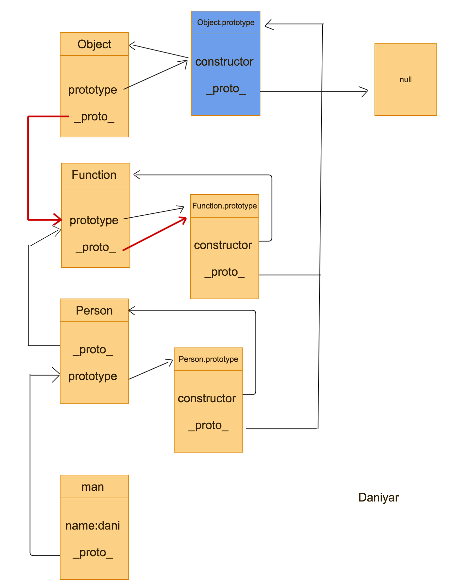

## JavaScript到底有几个类型？

js的类型划分有些混乱，但从常规来说，js有八种类型，前提是特殊的对象如函数和数组算作是Object类型，Error当做单独的类型。

- Number  
- String
- Boolean
- Symbol( Es6 )
- Object
  - Function
  - Array
  - Date
  - RegExp
- Null
- Undefined
- Error

要注意的是，Number和String还有Booolean等基本类型也可以通过“包装类”的方式变成对象类型数据来处理。可以说，`JavaScript`中的绝大部分数据都是对象，而且每个对象都继承于一个根对象，这个根对象就是`Object.prototype`。

```js
console.log( Object.getPrototypeOf( obj1 ) === Object.prototype ); // 输出：true
console.log( Object.getPrototypeOf( obj2 ) === Object.prototype ); // 输出：true
```
----------------
## 关于js的原型链

说实话，我觉得js中的原型(prototype), 原型链（prototype chain）等概念是是很复杂的，真正的理解需要自己去好好钻研一段时间。

首先，在js中除了null和undefined一切皆为对象，js通过原型链来实现的的面向对象的编程范式。但是，首先要明确的是，并不是所有对象都有`prototype`这个属性。
```js
var a = {};  
console.log(a.prototype);  //=> undefined

var b = function(){};  
console.log(b.prototype);  //=> {}

var c = 'Hello';  
console.log(c.prototype);  //=> undefined  
```
可以看出，一般的自定义对象是没有prototype属性的，js中的函数才有prototype属性。
>Each function has two properties: length and prototype

prototype和length是每一个函数类型自带的两个属性，这一点之所以比较容易被忽略或误解，是因为所有类型的构造函数本身也是函数，所以它们自带了prototype属性：

```js
console.log(Object.prototype);  //=> {}  
console.log(Function.prototype);//=> [Function: Empty]  
console.log(String.prototype);  //=> [String: '']  
```

介绍完完了prototype，我们再来看看`__proto__`。

在js中，所有对象都有一个内置的[[Prototype]],用来指向创造他的“父类”的prototy。因为在ES5之前没有标准的方法访问这个内置属性，所以大多数浏览器都支持通过`__proto__`来访问。ES5中有了对于这个内置属性标准的Get方法`Object.getPrototypeOf()`

刚已经提到了，`__proto__`指向创造他的“父类”的prototype，那谁是创造它的父类？对，就是构造函数。所以当我们在进行一个`new`操作的时候，js的引擎还帮我们做了这些事情：

```js
const a= new Foo();
// 等价于
var a = new Object();
a.__proto__ = Foo.prototype;
Foo.call(a);
```
三个步骤的作用不言而喻，首先是新建一个对象实例，然后将这个对象的内置属性指向这个构造函数的原型，然后改变a的作用域，使其拥有Foo的上下文。

所以通过这个`__proto__`,我们可以一直追溯到源头`Object.prototype`呢？ 答案或许不是那么简单。

让我们先看一下这个例子：

```js
function Person() {
}
var man = new Person();
man.name = 'dani';
```
按照刚才的理论，boy是Person构造函数一个实例，所以boy的`__proto__`会指向`Person.prototype`,这没问题。对于Person来说，它的`__proto__`又指向创造他的`Function`的`prototye`，这也没问题。

那么，`Function`也是一个构造函数，`Function.__proto__`又指向谁呢？

我们知道，js的函数是一种特殊的对象类型，那是应该指向创造他的Object吗？答案并不是。

因为`Function`作为一个构造函数的最顶端，只能来创造别人，不能被别人创造，所以这里
`Function.__proto__`就指向他自己的原型`Function.prototype`。`Function.prototype`作为一个`Object`对象，他的`__proto__`毫无疑问的指向`Object.prototye`,而我们知道，`Object.prototye`的`__proto__`也就是原型链的顶端，`null`。
如果你被绕进去了，可以看看这个图来加深印象。



注意这里画的两条红线，是和一般的自定义对象不同的两点，一个就是刚说的`Function.__proto__ === Function.prototype`,还有一个就是`Object.__proto__ === Function.prototype`。
因为Object也是一个被改造的类型，所以只能`__proto__`就指向了构造他的`Function.prototype`。对应着那个图，你可以猜下下面这些的表达式的结果。
```js
console.log('boy._proto_ === Person.prototype',boy.__proto__ === Person.prototype);
console.log('Person.prototype.constructor === Person', Person.prototype.constructor === Person);
console.log('Person.__proto__ === Function.prototype', Person.__proto__ === Function.prototype);
console.log('Person.prototype.__proto__ === Object.prototype', Person.prototype.__proto__ === Object.prototype);
console.log('Function.__proto__ === Function.prototype', Function.__proto__ === Function.prototype);
console.log('Function.prototype.__proto__ === Object.prototype',Function.prototype.__proto__ === Object.prototype );
console.log('Object.__proto__ === Function.prototype',Object.__proto__ === Function.prototype);
console.log('Object.prototype.constructor === Object',Object.prototype.constructor === Object);
```

是的，所有的结果都会显示为`true`。

那为什么js要用这种形式来实现继承呢，为什么我不能直接让一个修改对象的原型来达到效果呢？比如说这样的形式：
```js
function Person() {
  this.kind = 'man';
}
var boy = {};
boy.__proto__ = Person;
Person.call(me);
console.log('kind', boy.kind) //'man'
```
可以看出，通过这样的形式似乎也能继承Person的一些属性，那为什么这样的方式不行呢？很显然，聪明的你应该已经看出来了，如果直接将原型链与构造函数挂钩，会有一个很严重的问题，就是构造出来实例只能获得Person的属性，
而获得不了Person本身原型链上的属性。
```js
Person.prototype.speak = function() {
  console.log('and I can speak different language');
}
var boy = {};
boy.__proto__ = Person;
Person.call(me);
console.log('kind', boy.speak) //undefined
```


## 如何改变对象的原型链？
上一部分介绍了关于js原型链和原型对象的关系，现在我们再来看看js改变原型链的方式。

### Object.create()

这个方法是ES5新增的一个指定元素原型对象的方法，可以用它来实现对象的继承。

先看看字面意思，Object.create(),也就是说创造出来了一个对象，而且这个对象的`__proto__`属性指向了`()`里面设定的对象。
```js
// 创建一个原型为null的空对象
var a = Object.create(null);
// 创建一个原型为Object.prototype的空对象
var b = Object.create(Object.prototype);
console.log('a',a) //Object{}, no prototype
console.log('b',b); // Object{},
```
除此之外，`Object.create()`还能传递第二个参数，第二个参数可以作为这个新创建的对象值传递进去。但是，需要注意的是，这个传递进去的对象值真的是赤裸裸的对象值，既不能读也不能写。什么意思呢？
我们先来了解一下JS中的属性值，JS的属性值分两种，一种是数据属性，另一类是访问器属性(get和set)，对于数据属性，一般有这几个藏在背后的设置：

1. `[[Configurable]]`: 它表示能否通过`delete`来删除属性从而重新定义属性，能否修改属性的特性，或者能否把属性修改为访问器属性。直接在对象上定义的属性。

2. `[[Enumerable]]`: 表示能否通过`for－in`循环来返回属性。直接在对象上定义的属性。

3. `[[Writeable]]`: 表示能否修改属性的值。直接在对象上定义的属性。

4. `[[Value]]`: 包含这个属性的值。读取属性的时候，从这个位置读，写入属性的时候，把新的值保存在这个位置。这个特性默认的值为undefined。

在常规的属性赋值时，这些默认值都为true，然而用`object.create()`传递第二个参数的话，这些值前三个都会设为false，所以我们无法读写。解决办法就是将这些值定义好后传递进去。是不是觉得这样的方法多此一举？然而，我们可以利用这种设置完成更多实用的功能。


### Object.defineProperity

从字面上也同样可以看出来，这个方法是定义对象属性的，而且定义方式和上面提到的Object.create一样，需要添加额外的descriptor,具体的用法如下：
>Object.defineProperty(obj, prop, descriptor)

在介绍Object.create时候提到了数据属性，其实这里的属性描述同样我们能描述访问器属性。

- `get`: 取值函数，返回值会被当做这个属性的value
- `set`: 赋值函数，定义set后会允许属性更改value,这个函数会接收一个参数并把它赋值给这个属性的value

一般来说，这两个属性默认值都是undefined,一旦设置后就相当于设置`writeable = true`，看下面的用法：
```js
user = {}
nameValue = 'Joe';
Object.defineProperty(user, 'name', {
  get: function() { return nameValue },
  set: function(newValue) { nameValue = newValue; },
  configurable: true // 允许在稍后重定义这个属性
  });

user.name //Joe
user.name = 'Bob'
user.name //Bob
nameValue //Bob
```

这种方式似乎还不好看出来get和set的强大，如果和DOM操作联系起来，你就肯定可以明白了。

```js
function bindModelInput(obj, property, domElem) {
  Object.defineProperty(obj, property, {
    get: function() { return domElem.value; },
    set: function(newValue) { domElem.value = newValue; },
    configurable: true,
  })
}
user = {};
inputElem = document.getElementById("foo");
bindModelInput(user,'name',inputElem);

user.name = "Joe";
console.log("input value is now "+inputElem.value) //input元素现在的值是'Joe'
inputElem.value = 'Bob';
console.log("user.name is now "+ user.name) //现在model中的value是Bob
```
是的，这就是一个数据双向绑定的简易实现！`Vue`和很多框架都是用了这个原理来实现了数据的双向绑定。除了这样的方式以外，我们其实还可以通过ES7的`Object.observe()`来实现，但是这个还需要很多浏览器支持,下面贴一段已经通过jquery和Object.observer实现的数据双向绑定。
```js
function bindObjPropToDomElem(obj, property, domElem) {
  Object.observe(obj, function(changes){    
    changes.forEach(function(change) {
      $(domElem).text(obj[property]);        
    });
  });  
}

function bindDomElemToObjProp(obj, propertyName, domElem) {  
  $(domElem).change(function() {
    obj[propertyName] = $(domElem).val();
    console.log("obj is", obj);
  });
}

function bindModelView(obj, property, domElem) {  
  bindObjPropToDomElem(obj, property, domElem)
  bindDomElemToObjProp(obj, propertyName, domElem)
}
```
### Object.assign

这个方法用于将所有可枚举的属性的值从一个或多个源对象复制到目标对象。它将返回目标对象。
```js
Object.assign(target, ...sources)
```
那问题是，他是深复制还是浅复制呢？

答案是肯定的,肯定是浅复制。
```js
var a= {
  name:'dani',
  skills:{
    frontEnd:1
  }
}
var b = Object.assign(a);
a.skills.frontEnd = 2;
console.log('b',b); // 2
```
改变原有对象的属性，也会修改这个新属性的对象。

除此之外，这个方法也可以传入多个对象，这样新建的对象可以copy所有传入对象的属性，这种用法可以用来合并objects。

要注意的是，这个assign只能copy的可枚举的，不是继承的属性。
那如何才能做到copy一个对象的自身和继承属性呢？


## 将string转为数字有几种方法，有什么不同？
首先最常用的方法是`parseInt()`，该内置函数可以接收一个字符串并把它转为整数，而且parseInt还接收第二个参数，可以规定以什么进制去看待这个字符数。

还有一个不太常用的方法是`parseFloat()`,作用是将字符串解析为浮点数并返回。这个函数没有第二个参数。

除此之外，还有一个比较常用的方法就是在字符串前用`+`，即可将字符串中转为number类型数字。

需要注意的一点是，对于用`+`来转换字符串时，字符串如果是一个不可转换的值，则直接返回`NaN`,而`parseInt()` 和 `parseFloat()`是将字符串一个个拆分成字符后进行转换，如果分解的字符串里有可以转化的部分，那就会返回可分解的部分。

既然说到`NaN`，必须记住`NaN`与认识数相加都是`NaN`，对于数字或者字符串，我们可以用`isNaN()`函数来判断当前或者转换后是否是一个数字。


## 什么类型会被转换成false，什么类型是true？

- false、0、空字符串("")、NaN、null 和 undefined 被转换为 false
所有其他值被转换为 true

- 所有其他值被转换为 true


## 到底什么是多态？

多态其实是一种思想，是面向对象编程思想的一个重要表现。简单来说，多态就是对于不同的对象，同一个函数或者方法可以产生不同的解释和执行效果。形象化来说，就是“做什么”和”谁去做“，”怎么做”完全分离开。所以多态的作用显然易见，就是去除代码的耦合性。这一点在强类型语言例如java可以通过父类或者超类的继承来实现，但是在js中，因为没有类型检测，一个对象可以表示多个类型对象，所以说js的多态性与生俱来。下面这个例子就很好的诠释了多态。

> 在电影的拍摄现场，当导演喊出“action”时，主角开始背台词，照明师负责打灯 光，后面的群众演员假装中枪倒地，道具师往镜头里撒上雪花。在得到同一个消息时， 每个对象都知道自己应该做什么。如果不利用对象的多态性，而是用面向过程的方式来 编写这一段代码，那么相当于在电影开始拍摄之后，导演每次都要走到每个人的面前， 确认它们的职业分工（类型），然后告诉他们要做什么。如果映射到程序中，那么程序 中将充斥着条件分支语句。


## 用最精炼的语言去解释this？

在`JavaScript`中，**this永远指向一个对象，但是具体指向哪个对象是由函数运行的时候基于函数的执行环境去绑定，而不是在函数声明时候的环境。**


## call 和 apply 的用途 ？
首先要回答的是，call和apply都是干的一个事情，他们两的区别只在于传入参数的形式不同，apply传入的第二个参数可以使数组或者类数组，call传入的参数数量不固定。

- #### 改变this指向
最常见的用途之一，可以从如下的例子中看出
```js
var obj1 = { name: 'sven' };
var obj2 = { name: 'anne' };
window.name = 'window';
var getName = function(){
  alert ( this.name );
};
getName(); // 输出: window
getName.call( obj1 ); // 输出: sven
getName.call( obj2 ); // 输出: anne
```

- #### 借用其他对象的方法

  借用方法的第一种场景是借用构造函数，通过这种技术，可以实现类似继承的效果
```js
var A = function( name ){
  this.name = name;
};
var B = function(){
  A.apply( this, arguments );
};
B.prototype.getName = function(){
  return this.name;
};
var b = new B( 'sven' );
console.log( b.getName() ); // 输出： 'sven'

```
   借用方法的第二章是借用一些内置函数的内置方法。

  比如说函数的参数列表 `arguments` 是一个类数组对象，虽然它也有“下标”，但它并非真正的数组， 所以也不能像数组一样，进行排序操作或者往集合里添加一个新的元素。这种情况下，我们常常 会借用` Array.prototype`对象上的方法。比如想往 arguments 中添加一个新的元素，通常会借用 `Array.prototype.push`：

- #### 实现`Funtion.prototype.bind()`


## 通俗的解释闭包

引用一句道格拉斯大叔的话：
>闭包是指在JavaScript中，内部函数总是可以访问其所在的外部函数中声明的参数和变量，即使在其外部函数被返回（寿命终结）了之后。

引用一下JavaScript花园的解释：
>闭包是 JavaScript 一个非常重要的特性，这意味着当前作用域总是能够访问外部作用域中的变量。 因为 函数 是 JavaScript 中唯一拥有自身作用域的结构，因此闭包的创建依赖于函数。

okay，如果说通过这两个你可以看出来闭包的作用是为了数据的私有性，那么问题来了：

- 闭包的应用场景？
- 闭包和ES6中其他使用数据私有的方式（Class，Symbol）比较？
- 闭包中的数据/私有化的数据的内存什么时候释放？


让我们依次来回答一下这些问题：

- 闭包的应用场景？
1. 因为js没有私有成员的概念，我们可以利用闭包来模拟私有成员，实现对私有成员的保护，从而达到约束和规范代码的作用。
2. 在函数柯里化中使用。
3. 在js中使用单例模式的时候使用闭包,如下：
```js
var singleton = function( fn ){
    var result;  
    return function(){
        return result || ( result = fn .apply( this, arguments ) );
    }
}

var createMask = singleton(
    function(){
        return document.body.appendChild( document.createElement('div') );
    }
)
```
4. 使用闭包来绑定this变量（已经不再流行）

## 关于 apply、call和bind的所有

首先，你需要先理解在js中上下文的概念，js中函数里的上下文(context)分为定义上下文，还有执行上下文，而且还有一个很重要的特性就是函数的上下文可以改变。

那我们通过什么方式来改变这个上下文呢？答案就是js给每个函数的原型上自带的call和apply函数。总而言之，**call和apply的作用就是改变函数的执行上下文**

因为js的天生多态性，我们经常会遇到定义了一个对象的一些方法，然后我们想在另外一个对象直接使用这些方法的情况，比如说：
```js

var fruits = {
    color: "red",
    say: function() {
        console.log("My color is " + this.color);
    }
}
var vegetiable = {
   color:"green"
 }
vegetiable.say();    // vegetiable.say is not a function
```
在vegetiable运行的时候，他的上下文指向vegetiable，但是vegetiable里没有say这个方法，所以这时候，我们就可以使用apply和call方法来强行的改变执行上下文。

```js
var vegetiable = {
   color:"green"
 }
fruits.say.call(vegetiable);   // My color is green
```

如果我们用形式化的表示来表达call函数，那就会是`已经存在的方法.call(想要使用这个方法的对象，给这个方法传进去的参数)`。

前面说到call和apply完全一样，只是参数传递方式不同，就是说call是一个，一个参数进行传递，符合我们经常使用的function的参数传递习惯，而apply传递的是一个参数数组。就这点区别。

刚开始接触的时候，我对这种情况还比较疑惑，为什么call的第一个参数会是null或者拥有这个方法的自身? 思考下面的例子：
```js
var arr = [1,2,4,56];
Math.max.apply(Math, arr); //56
Math.max.apply(null, arr);  // 56
Math.max.apply(Object, arr); // 56
```
为什么我传递的是不同的对象，但是三者的结果都是一样的呢 ？后来发现自己绕进去了，虽然确实传递了不同的函数上下文，但是，`Math.max()`这个方法和执行上下文有关系吗？
我只是需要将数组，变成一个个的参数传递进去得出结果即可，并不关心当前的上下文。

okay，下面让我们再来看看bind函数。
bind函数其实和apply还有call的作用差不多，目的也是为了改变函数内的this指向，但是`bind()`是创建了一个函数，需要我们再去进行调用。bind的本质其实就是返回了一个闭包：

```js
function bind(fn, context) {
  return function() {
    return fn.apply(context, arguments);
  }
}
```
当然真正的bind函数比上面这个要复杂一些，你还可以实现函数传参等，但是本质上就是这个思想。还是上面的例子，我们也可以用bind函数进行改写，
```js
var fruits = {
    color: "red",
    say: function() {
        console.log("My color is " + this.color);
    }
}
var vegetiable = {
   color:"green"
 }
// === bind(fruits.say, vegetiable)();
fruits.say.bind(vegetiable)(); // My color is green
```
和apply还有call的区别是不是豁然开朗？


总结一下：
- `apply`、`call`、`bind` 三者都是用来改变函数的this对象的指向的；
- `apply` 、`call` 、`bind` 三者第一个参数都是`this`要指向的对象，也就是想指定的上下文；
- `apply` 、 `call`、`bind` 三者都可以利用后续参数传参；
- `bind` 是返回对应函数，便于稍后调用；`apply` 、`call` 则是立即调用 。


## 函数柯里化

既然说到闭包的作用力有函数柯里化，那不仿让我们看看什么是函数柯里化。
从概念上来说，柯里化是这么定义的的：
>柯里化（Currying），又称部分求值（Partial Evaluation），是把接受多个参数的函数变换成接受一个单一参数（最初函数的第一个参数）的函数，并且返回接受余下的参数而且返回结果的新函数的技术。


## `setInterval`和`setTimeout`详解

`setInterval`和`setTimeout`区别不是很大，只是`setInterval`是每隔一段时间执行一次代码，而`setTimeout`是推迟一段时间后去执行（只执行一次），但是如果仔细分析`setInterval`和`setTimeout`的内部机理，有很多有意思的地方。

- 1，`setInterval`和`setTimeout`除了接受第一个参数为回调函数，第二个时间参数外，还可以接受更多的参数，这些多余的参数会传入第一个回调函数中。

- 2,  `setInterval`和`setTimeout`的作用机制都是在当前`evenl loop`之后再去运行。例如下面的程序：
  ```js
  setTimeout(function () {
      func1();
  }, 0)
  func2();
  ```
  要问到func1和func2哪个先执行，那必然是func2。每一轮Event Loop，``setTimeout``和``setInterval``都是把任务添加到“任务队列”的尾部。因此，它们实际上要等到当前脚本的所有同步任务执行完，然后再等到本次Event Loop的“任务队列”的所有任务执行完，才会开始执行。由于前面的任务到底需要多少时间执行完，是不确定的，所以没有办法保证，**`setTimeout`和`setInterval`指定的任务，一定会按照预定时间执行。**

  也就是说，对于一个很长时间的任务，只有在这个任务完成之后才会考虑到我们的``setTimeout``和``setInterval``,那如果这个长时间任务是1秒，我们的``setInterval``要求每隔两秒执行一次，我们的``setInterval``会在3秒之后执行吗？并不是。虽然是等eventloop执行完之后才开始执行，但是他还有一个检查机制。`setInterval`指定的是“开始执行”之间的间隔，并不考虑每次任务执行本身所消耗的事件。实际上，两次执行之间的间隔会小于指定的时间。比如，`setInterval`指定每100ms执行一次，每次执行需要5ms，那么第一次执行结束后95毫秒，第二次执行就会开始。如果某次执行耗时特别长，比如需要105毫秒，那么它结束后，下一次执行就会立即开始。为了确保两次执行之间有固定的间隔，可以不用`setInterval`，而是每次执行结束后，使用`setTimeout`指定下一次执行的具体时间。上面代码用`setTimeout`，可以改写如下。
  ```js
  var i = 1;
  var timer = setTimeout(function() {
    alert(i++);
    timer = setTimeout(arguments.callee, 2000);
  }, 2000);
  ```
下面再看一下clearTimeout和cleatInterval，从名字上也可以判断，这两个函数就是为了清除setTimout和setInterval函数设置的定时器，简单的用法不用多说了。我们来看下面这个比较有意思的例子。

```js
function fn1() {
  for (var i = 0; i < 4; i++) {
    var tc = setTimeout(function(i) {
      console.log(i);
      clearTimeout(tc)
    }, 1000, i);
  }
}
fn1();
```
你觉得会输出什么呢？如果没有cleatTimeout，你可能很容易看出来将会输出`0, 1, 2, 3`,然而再setTimeout中再设置cleatTimeout，输出居然变成了：
```
0,
1,
2
```
恩？`3`去哪里了？这可能是大部分像我一样人的疑惑。

如果仔细分析，其实不难发现，这个tc是定义在闭包外面的，也就是说tc并没有被闭包保存，所以这里的tc指的是最后一个循环留下来的tc，所以最后一个3被清除了，没有输出。再来看一个例子：
```js
function fn2() {
  for (var i = 0; i < 4; i++) {
    var tc = setInterval(function(i, tc) {
      console.log(i);
      clearInterval(tc)
    }, 1000, i, tc);
  }
}
fn2();
```
现在又会输出什么呢？答案是输出0,1,2,3,3,3...。
明明是用闭包的形式把tc也传递进去了，什么最后的3没有被清除呢？原因是因为js的执行顺序。在js中，我们是单线程从上往下，从右往左的执行，所以上述的代码会先设置setInterval然后再把setInterval的值赋给tc，也就是说第一次设置setInterval的时候，
tc是undefined，然后第二次设置的时候tc是i=0时候定时器设置的值，同理第三次设置的是i=1的，第四次设置的是i=2的，而i=3的tc并没有被传递进去，也就是没有被清除，这就导致一直会循环输出3。


## 总结一下js里的各种遍历方式


| 遍历方式 | 概念 | 可以遍历的类型 | 不能遍历的类型 | 其他 |
|---| ----- | -------- | ---------- | --- |
|`for()`,`while()`|最常规的循环遍历方式|`Array`,`String`|`Object`,`Map`，`Set`|可以遍历map和set，但是无意义,因为取不到值|
|`for... in...`|以**任意顺序**遍历一个对象的**可枚举属性**。对于每个不同的属性，语句都会被执行。|`Array`,`String`,`Array`,`Object`|`Map`,`Set`|遍历时不是按特定顺序|
|`for...of...`|在**可迭代对象**上创建一个迭代循环，对每个不同属性的属性值,调用一个自定义的有执行语句的迭代挂钩.| `Array`, `Map`, `Set`, `String`, `arguments`|`Object`|

#

## 跨域

## 关于各种类型转换的方法

## 构造函数 成员函数这些都是什么

## iframe的使用场景

- 1：典型系统结构，左侧是功能树，右侧就是一些常见的table或者表单之类的。为了每一个功能，单独分离出来，采用iframe。
- 2：ajax上传文件。
- 3：加载别的网站内容，例如google广告，网站流量分析。
- 4： 在上传图片时，不用flash实现无刷新。
- 5： 跨域访问的时候可以用到iframe，使用iframe请求不同域名下的资源。


## getter和setter到底是什么

首先来说说从ES5中新引入的get和set，这两个属性都是见过但是没有研究过的属性。如果我们在控制台实际演练一遍，我们就很清楚get和set的作用：
```js
var o = {
       a : 7,
       get b(){return this.a +1;},//通过 get,set的 b,c方法间接性修改 a 属性
       set c(x){this.a = x/2}
   };
   console.log(o.a);   // 7
   console.log(o.b);  //  8
   o.c  = 50;  
   console.log(o.a); //  25
```
- getter
使用get关键字为属性添加一个函数，函数名即为属性名，当对象访问此属性时，将自动调用定义的函数，并返回相应的值，相当于隐式的创建了一个访问此属性的函数。Getter的函数不传参数，在一个对象里不能对一个属性定义多个getter，此外，真实的属性不能与getter共存。

- setter
同getter一样，在对象设置属性值时，自动调用由set关键字定义的函数。函数需要传入一个value，value即为设置对象属性的值。

也就是说，结合getter与setter，可以给对象添加一个伪属性，这个属性是可以通过动态计算得来的，访问属性即调用了方法进行动态计算，免去了许多不必要的定义的各种访问函数。

## JS值传递还是引用传递最好的解释

这个问题是是测试是否掌握JS基础的很经典的一道题目。大家都会说，js在传递对象的时候是引用传递，在传递值类型数据的时候是引用传递。其实这种说法本身是不正确的，比如
```js
function changeStuff(a, b, c)
{
  a = a * 10;
  b.item = "changed";
  c = {item: "changed"};
}

var num = 10;
var obj1 = {item: "unchanged"};
var obj2 = {item: "unchanged"};

changeStuff(num, obj1, obj2);

console.log(num); //10
console.log(obj1.item); //changed   
console.log(obj2.item); //unchanged
```
前两个输出都能理解，那到了第三个输出的时候是不是就会有点犹豫不决呢？如果对象是按引用传递，那改变对象本身是否会改变原对象的值？事实是JS既不是值传递，也不是引用传递，而是共享传递（call by sharing）

该策略的重点是：调用函数传参时，函数接受对象实参引用的副本。它和按引用传递的不同在于：在共享传递中对函数形参的赋值，不会影响实参的值。即修改传递的对象本身(形参)是不会影响到原来的对象(实参)的。

所以，对于对象类型，由于对象是可变(mutable)的，修改对象属性会影响到共享这个对象的引用和引用副本。而对于基本类型，由于它们都是不可变的(immutable)，按共享传递与按值传递(call by value)没有任何区别，所以说JS基本类型既符合按值传递，也符合按共享传递。

如果再想深入练习，可以通过`如何编写一个对象的拷贝函数`来掌握。

虽然实现深复制的办法有很多种，最简单的：
```js
var cloneObj = JSON.parse(JSON.stringify(obj));
```
其实这只是一个投机取巧的办法，因为JS的对象的深度拷贝不是那么容易实现的。往往我们说对一个对象的深度拷贝时，我们的语义就不清。因为JS中万物皆对象，会有很多edge case，比如对象里有Regexp怎么办，对象里有函数怎么办，对象原型链怎么办，对象里有闭包怎么去复制，再比如对象里有`setInterval`函数那你怎么办？因为js的的弱类型，所以不应该去简单的考虑对象的深度拷贝，在实现对象拷贝之前，我们需要选择好范围。如果只是一个实现简单的关于数组和对象的拷贝，那完全可以用递归的方法去解决就行。
```js
var cloneObj = function(obj){
    var str, newobj = obj.constructor === Array ? [] : {};
    if(typeof obj !== 'object'){
        return;
    } else {
        for(var i in obj){
            newobj[i] = typeof obj[i] === 'object' ?
            cloneObj(obj[i]) : obj[i];
        }
    }
    return newobj;
};


```

## null和undefined的区别

`null == undefined`的结果是`true`也许是检验是否知道两者区别的开始。除去一些历史原因外，`null`和`undefined`基本是同义的，两者现在的一些区别如下：
- `null`表示“没有对象”，即该处不应该有值。典型用法是
  1.  作为函数的参数，表示该函数的参数不是对象
  2.  作为对象原型链的终点
- `undfined`表示”缺少值“，就是此处应该有一个值，但是还没有定义
  1.  变量被声明了，但没有赋值时，就等于`undefined`
  2.  调用函数时，应该提供的参数没有提供，该参数等于`undefined`。
  3.  对象没有赋值的属性，该属性的值为`undefined`。
  4.  函数没有返回值时，默认返回`undefined`。

```js
var i;
i // undefined

function f(x){console.log(x)}
f() // undefined

var  o = new Object();
o.p // undefined

var x = f();
x // undefined
```


## typeof 和 instanceof 操作符的区别

### typeof
首先概念需要明确，typeof返回的是一个表达式的数据类型的字符串，返回结果为js基本的数据类型，包括`number`,`boolean`,`string`,`object`,`undefined`,`function`。

原本来说，一个变量是什么typeof就应该返回什么，然而在js中，typeof返回的值更多的与这个对象创建的方式有关。
```js
var a = 1;
var b = new Number(1);
console.log(typeof(a)) // number
console.log(typeof(b)) // object
```

这就导致了typeof在实际使用中不能完全放心的用来判断一个变量的类型。较为准确的类型保存在变量的内部属性`[[Class]]`中，常常需要通过定义在`Object.prototype`上的方法`toString`来获取。
typeof更多的作用是判断一个变量是否定义或者已经赋值。

### instanceof
定义：判断一个对象是否为某一个数据类型或者一个变量是否为一个对象的实例。
同样的，instanceof和typeof有一样的问题，对于内置类型的变量还是力不从心：
```js
console.log("abc" instanceof String); // false
console.log("abc" instanceof Object); // false
console.log(new String("abc") instanceof String); // true
console.log(new String("abc") instanceof Object); // true
```
但是对于自定义的对象，判断是否一个变量是一个对象自身或者原型链的实例还是很经常会用到：
```js
function Person() {
  this.life = true;
}
function Man() {
  this.interest = 'sport';
}
Man.prototype = new Person();
console.log(new Man() instanceof Man); // true
console.log(new Man() instanceof Person); // true
```
可以看到， `instanceof`就是用来判断一个对象在其原型链中是否存在一个构造函数的 `prototype `属性。
## 关于javascript的事件处理

js的事件处理也是一个需要认真的理解的部分，推荐去阅读`于江水`的[JavaScript和事件](http://yujiangshui.com/javascript-event/#%E4%BA%8B%E4%BB%B6%E8%A7%A6%E5%8F%91%E8%BF%87%E7%A8%8B)，讲的逻辑十分清楚，让人有一种豁然开朗的感觉。

下面我就结合我自己的理解已经上篇博文，对js事件做一个容易忽略的点的总结。

### js监听事件的触发方式

一般来说，js监听事件的方式主要由通过HTML内联属性（不推荐），DOM属性绑定，和使用事件监听函数来完成。一般最常用的就是添加事件监听函数和去除如下：
```js
element.addEventListener(<event-name>,<callback>,<use-capture>)；
element.removeEventListener(<event-name>, <callback>, <use-capture>);
```
监听函数有两点需要主要，一个是第二个参数callback函数不能是匿名函数，另外一个就是<use-capture>这个参数是设置是否在“捕获”阶段监听。

### 事件触发过程
js事件有三个过程，这三个过程的每一个含义必须十分清楚，我们可以通过下面这个图进行分析：


- 捕获阶段(Capute Phash)
当DOM树的某个节点发生操作，事件是从WIndo发出的，通过不断遍历下级节点一直在到底目标节点之前的过程，就是捕获阶段。可以说，捕获阶段的任务就是建立这个事件传递路线，然后冒泡阶段就会沿着这条路返回window。

- 目标阶段（Target Phase）
这个阶段需要注意的是，事件触发的幕布总是最底层的节点。

- 冒泡阶段（Bubbling Phase）
这个阶段就是事件会随着第一个捕获阶段建立的路线原路返回，只有返回到window，事件才可以触发。

### 事件代理

因为事件的冒泡机制，我们可以通过监听父级节点来实现监听子节点的功能。这就是事件代理。事件代理的好处很明显，想想这一个场景，一个ul列表一系类的li子节点，我需要实现点击li就触发的事件监听，使用事件代理让我们监听绑定在ul上，从而减少事件绑定。其次，万一哪天需要动态添加li节点，我们仍然可以接听。

### 事件Event对象
事件监听函数的第一个对象就是Event Object，这个对象里面包含了一些有用的属性或者方法,对以下的基本方法作用需要略知一二。

- type(string)： 事件的名称
- target(node):
- bubbles(boolean)
- preventDefault(function)
- stopPropagation（function）
- stopImmediatePropagation（functon）
- pageX/pageY(number)
- isTrusted(boolean)

### 其他常用事件

除了最常用的click事件之外，这里还有另外几种常用的事件

#### load
load 事件在资源加载完成时触发。这个资源可以是图片、CSS 文件、JS 文件、视频、document 和 window 等等。

比较常用的就是监听 window 的 load 事件，当页面内所有资源全部加载完成之后就会触发。比如用 JS 对图片以及其他资源处理，我们在 load 事件中触发，可以保证 JS 不会在资源未加载完成就开始处理资源导致报错。

同样的，也可以监听图片等其他资源加载情况。比如说，说一个最近的阿里面试题，给定一个image图片地址数组，我现在想要做一个功能，即每隔固定时间去加载图片，需要怎么完成？来看看代码如下；
```html

<button id="nextButton"></button>
```
```js
const imgsList =['','',''];
const image = document.querySelector('.image');
image.setAttribute('src',imgsList[0]);

image.addEventListener('load',loadNextImage);

function loadNextImage(event) {
    setTimeout(showNextImage, 1000)
}

function showNextImage() {
    const image = document.querySelector('.image');
    const currentIndex = parseInt(image.getAttribute('index')) || 0;
    if(currentIndex === imgsList.length - 1) nextIndex = 0
    else nextIndex = currentIndex + 1
    image.setAttribute('src',imgsList[nextIndex]);
    image.setAttribute('index',nextIndex);
}
```


## 关于js文件的加载顺序？
首先，需要了解的是`<script>`标签引入脚本的几种情况：

- 立即执行
> <script src = "a.js">
> <script src = "b.js">

顺序：保证先后顺序。解析：HTML 解析器遇到它们时，将阻塞（取停止解析），待脚本下载完成并执行后，继续解析标签之后的文档。这种就是我们最常见的一种方式，有时候我们也会把这样的执行放在body之下，这样就可以等页面加载完成后再去解析文档。

- 推迟执行
> <script defer src="a.js">
> <script defer src="b.js">

顺序：保证先后顺序。解析：HTML解析器遇到他们时，不阻塞（脚本将被异步下载），待文档解析完成后，执行脚本。

- 尽快执行
> <script async src="a.js">
> <script async src="b.js">

顺序：不保证先后顺序。解析：HTML 解析器遇到它们时，不阻塞（脚本将被异步下载，一旦下载完成，立即执行它），并继续解析之后的文档。

有一张图可以帮助理解：
[script解析顺序](https://pic4.zhimg.com/284aec5bb7f16b3ef4e7482110c5ddbb_b.jpg)


## 对前端模块化的理解？
> 推荐去直接浏览黄玄的`JavaScript模块化七日谈`

在说到前端模块化之前，让我们想一想为什么前端需要模块化。在以前的js代码中，我们可能是这么写的；
```js
function foo(){
    //...
}
function bar(){
    //...
}
```
因为这样很容易造成变量名冲突，我们又改成了这样：
```js
var MYAPP = {
    foo: function(){},
    bar: function(){}
}

MYAPP.foo();
```
可是，这样还是不安全，因为你无法定义私有变量，所以我们又了IIFE模式：

```js
var Module = (function(){
    var _private = "safe now";
    var foo = function(){
        console.log(_private)
    }

    return {
        foo: foo
    }
})()
Module.foo();
Module._private; // undefined
```
这种写法，就是现代依赖的基石。
然而上面的只是执行段，在加载端，我们的代码很有可能是一堆的script标签，而且必须要考虑顺序，不仅难以维护，而且依赖模糊，最重要的是请求过多。
直到有一天，CommonJS诞生，我们可以轻松的进行依赖引用：

```js
// math.js
exports.add = function(a, b){
    return a + b;
}
// main.js
var math = require('math')      // ./math in node
console.log(math.add(1, 2));    // 3
```

所以以CommonJS为主的Node让我们在服务器端也可以用js来加载各种模块，然而问题是，CommonJS的require是同步的，这在本地环境或者服务器上没有问题，但是浏览器环境，那就是各种阻塞！

所以我们又有了以RequireJS为代表的AMD规范，以SeaJS为主的CMD规范。AMD和CommJS还有CMD的书写风格和执行时间如下：
```js
// Module/1.0
var a = require("./a");  // 依赖就近， 执行到此时，a.js 同步下载并执行
a.doSomething();

var b = require("./b")
b.doSomething();

// AMD recommended style
define(["a", "b"], function(a, b){ // 依赖前置
    a.doSomething();
    b.doSomething();
})

// AMD with CommonJS sugar
define(["require"], function(require){
    // 在这里， a.js 已经下载并且执行好了
    var a = require("./a")
})

// CMD recommanded
define(function(require, exports, module){
    var a = require("a");
    a.doSomething();
    var b = require("b");
    b.doSomething();    // 依赖就近，延迟执行
})
```
总结一下来说，AMD和CMD的区别如下：
1. 对于依赖的模块，AMD是提前执行，CMD是延迟执行

2. CMD推崇依赖就近，AMD推崇依赖前置

其实seajs/requirejs作为在线“编译”模块的方案，相当于在页面即浏览器端加载一个CMD/AMD解释器。这样浏览器就认识了define，exports，module这些东西。

不久之后，另一类模块化方案横空出世，即预编译模块化方案，就是把所有的js组件bundling up，编译成一个`bundle.js`文件，最先出现的是`browserify`,通过`auto-recompile`,加入`source map`这些特性使模块化变得更加方便
```shell
$ npm install -g browserify
# magic just happened!
$ browserify main.js -o bundle.js
# install watch
$ npm install -g watchify
$ watchify app.js -o bundle.js -v
# debug mode
$ browserify main.js -o bundle.js --debug
```

但是新问题又来了，因为现在app的功能正在越来越丰富，browserify很有可能打包出来一个庞大的`bundle.js`文件，真是的app里，`bundle`文件可能有10M到15M，这样很有可能使应用一直处于加载中状态。这时候`webpack`就横空出世了，它采用了许多新的特性：
  - Strong Compatibility： 对CommonJS, AMD, ES6都有着完美支持
  - Loaders & Plugins：使用各种功能强大的Loader和来加载所有静态文件
  - Code Spliting：分割代码成许多chunk从而实现异步按需加载
  - Development Tools： 用DevServer来实现热加载，alias等

最后的最后，就是我们的王者归来，ES6的`import`。通过语言层面上的规定，js可以说真正实现了模块化机制。关于import的更多机制，可以参考我的[all-about-ES6](,/all-about-ES6.md)


[关于js模块化方案](http://upload-images.jianshu.io/upload_images/4971047-7f34b4f50e232341.png?imageMogr2/auto-orient/strip%7CimageView2/2/w/1240)


## 关于网站性能优化

>网站性能优化是一个工程问题。

在网站性能优化方面，我们一般可以分为服务器端的优化和页面优化。下面首先先说一下页面优化。

我认为任何抛开了性能瓶颈去谈优化都是不现实的，我们首先需要了解的是一个网页的生成过程。通常来说，网页的生成过程，大致可以发为五步：
1. HTML代码转化成DOM
2. CSS代码转化成CSSOM（CSS Object Model）
3. 结合DOM和CSSOM，生成一棵渲染树（包含每个节点的视觉信息）
4. 生成布局（layout），即将所有渲染树的所有节点进行平面合成
5. 将布局绘制（paint）在屏幕上

这五步中，前三步都比较快，主要是后两步，我们合并成为渲染。网页生成的时候，至少会渲染一次。用户访问的过程中，还会不断重新渲染。但是如果我们进行`修改DOM`，`修改样式表`，或者添加`用户时间`，就会触发重新生成布局和重新绘制。我们可以用chrome的Timeline面板来很全面的分析各个阶段的耗时，包括loading，scripting，rendering，和painting
[TimeLine面板](http://www.ruanyifeng.com/blogimg/asset/2015/bg2015091515.png)

通过这个还有chromeDeVTool的Profile我们就可以试着去寻找到底应该优化的是什么方向。

根据一般经验，我们可以把优化方向聚在这几个范围：

#### 减少loading阶段的耗时

loading阶段的耗时估计是一些不成熟的网站最容易优化的点，我们可以从多个方面入手：

- 请求数量和带宽

在这个阶段我们可以充分利用webpack/browserify等打包工具,将js打包成一个bundle的js文件，从而达到合并压缩文件的特性。除此之外，我们还可以开启GZIp，移除重复脚本，图像优化等方面竟尽可能的减少请求贷款、

- 利用缓存

另外一个优化loading的手段估计就是充分利用缓存。可以使用各种cdn来加载一些必要组件，比如使用font-awesome来加载常用的icon，达到减少dns查找的目的。

- 使用HTTP2
还不太了解，不多说

- 按需加载

这一点也可以有webpack等打包工作做到。除此之外还能用一些滚屏加载，通过media query来加载不同css等各种方式。


#### 关于脚本执行和渲染的优化

优化脚本执行的过程就是严格提高我们的代码质量，如果使用框架尽量遵循每个框架的最佳实践等。通常来看，我们可以避免这些不必要的点：

- 避免图片和ifram等的空src
- 在使用 DOM 操作库时用上 array-ids （如angular使用trackby，减少重绘制）
- 给图片加上正确的宽高值避免重设图片大小
- 避免css表达式，移除空的css规则
- 正确使用display的属性
  1.display: inline 后不应该再使用 width、height、margin、padding 以及 float
  2.display: inline-block 后不应该再使用 float
  3.display: block 后不应该再使用 vertical-align
  4.display: table-* 后不应该再使用 margin 或者 float
- 不滥用float
- 不声明过多的font-size
- 值为0时候不需要任何单位
- 尽量使用CSS3动画


### 对于js缓存的利用

catch-control：max-age

Expires:

Etag:

If-Modified-Since/Last-Modifed


## 参考链接：
- [使用原生JavaScript实现数据绑定](http://www.html-js.com/article/A-day-to-learn-JavaScript-using-the-native-JavaScript-data-binding)
- [深入浅出妙用 Javascript 中 apply、call、bind](http://web.jobbole.com/83642/)
- [移动 H5（PC Web）前端性能优化指南](https://zhuanlan.zhihu.com/p/25176904)
- [JavaScript 模块化七日谈](https://huangxuan.me/js-module-7day/)
- [Webpack,broserify和gulp三者之间到底是怎样的关系](https://www.zhihu.com/question/37020798/answer/71621266)
- [js中__proto__和prototype的区别和关系？](https://www.zhihu.com/question/34183746)
- [JavaScript里的Getter与Setter](http://www.jianshu.com/p/dd83cb399b81)
- [undefined和null区别-阮一峰](http://www.ruanyifeng.com/blog/2014/03/undefined-vs-null.html)
