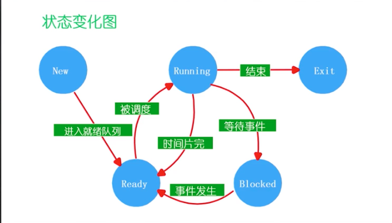
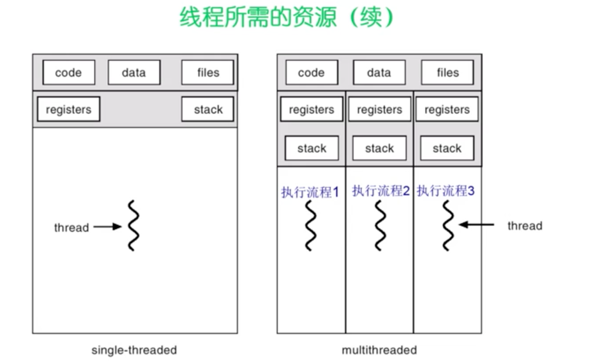
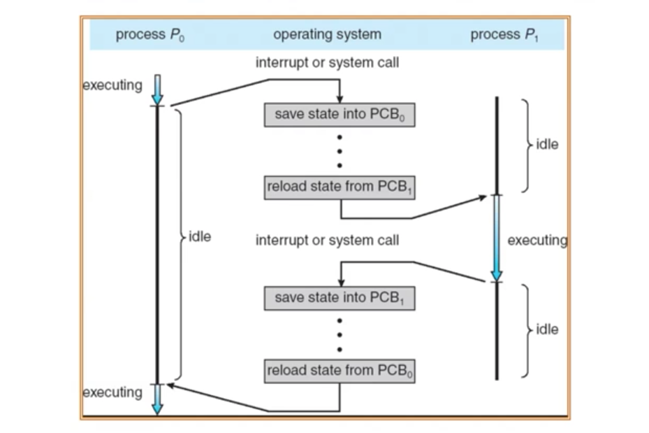

## Kernal的特征

- 并发
 - 并发和并行的区别？

 并发是一段时间多个进程在执行，并行是一个时刻多个进程执行。

- 共享
  - “同时”共享还是”互斥“共享？

- 虚拟
  - 硬件虚拟化（CPU-》进程； 内存-》地址空间； 磁盘-》文件）

- 异步
  - 只有一个CPU的情况，怎样调度另一个程序？
  - 怎样在异步的过程中，保证每次运行的结果和时间相同？

操作系统在DISk中，由BIOS提供I/O处理系统

Bootloader：加载OS

#### BISO启动后执行的任务：

- 自检 寻找基本设备如显卡，键盘鼠标

- 将BootLoader从硬盘放到内存中

#### Bootloader启动后完成的工作：

- 将操作系统的代码和数据从硬盘加载到内存中

### 系统调用和异常还有中断的概念

- 系统调用 ：应用程序主动向操作系统发出的服务请求
  来源于应用程序，处理时间为异步或同步

- 异常：非法指令或者其他坏的处理状态，如内存出错
  来源于不良的应用程序, 意想不到的行为，处理时间为异步，

- 中断： 来自不同的硬件设备的计时器和网络中断
  来源于外设，处理时间为同步

> 问题： 为什么应用程序不能直接操作内核？ 因为安全性

### 用户态 和 内核态
  - 用户态： 应用程序运行的时候CPU所处的状态
  - 内核态： 操作系统运行的时候CPU所处的状态，可以使用任何特权操作

>问题： 系统调用和应用程序的函数调用的不同？

### 地址空间

定义：

- 物理地址空间：硬件支持的地址空间

- 逻辑地址空间： 一个运行的应用程序所拥有的内存范围

逻辑地址生成：

- 是由loader将程序从硬盘中读取放到内存中，由程序语言到汇编语言再到机器语言生成一个逻辑地址

逻辑地址怎么物理地址对应？

- 是由cpu有个叫MMU的区域，有一个标注关系的映射表

怎么去保护：

###  内存碎片问题

#### 分配策略

- 首次分配：将空间地址块进行排序，找到第一个满足大小条件的分配就可以。
    - 优点 ：简单，易与生存更大空间块
    - 缺点 ： 会造成比较多的外部碎片

- 最优适配算法： 找到最适合大小的分配快
    - 优点：避免了分割大空间块
    - 缺点：重分配慢
- 最坏适配算法： 找到差距最大的分配快
    - 优点：加入分配是中等尺寸效果最好
    - 缺点：易于破碎大的空间快

## 进程
### 进程描述 ：  
进程定义：一个具有一定独立功能的程序在一个数据集合上的一次动态执行过程。(将静态的程序变成动态)
**进程包含了正在进行的一个程序的所有状态信息**
  - 程序的代码
  - 程序处理的数据
  - 程序计数器中的值，指示吓一跳将运行的指令
  - 一组通用的寄存器的当前值，堆，栈
  - 一组系统资源（如打开的文件）

- 和程序的关系：

  - 程序是产生进程的基础
  - 程序的每次运行构成不同的进程
  - 进程是程序功能的体现
  - 通过多次执行，一个程序可应对多个进程，通过调用关系，一个进程可包含多个程序

- 和程序的区别
  - 进程动态，程序静态；程序是有序代码的集合，进程是程序的执行；
  - 进程是暂时的程序是永久的，进程是一个状态变化的过程，程序可以持久保存
  - 进程与程序的组成不同

- 进程的特点：
  - 动态性：可动态的创建，结束进程
  - 并发性：进程可以被独立调度并占用处理机运行；
  - 独立性：不同进程的工作不相互影响（正确性不受影响），通过给每个进程分配不同的地址空间，即页表来完成
  - 制约性： 因为访问共享数据，资源或进程同步而产生制约

>拓展问题： 如果是你，怎么样来实现进程管理机制，来实现进程的特点？

### 进程控制快PCB

定义：操作系统管理控制进程运行所用的信息集合,和进程是一对一的关系

#### PCB组成：
  - 进程标识信息，即ID，父进程信息，用户标示
  - 处理器状态信息：保存进程的运行现场信息
    - 用户可见寄存器
    - 控制和状态寄存器
    - 栈指针信息
  - 进程控制信息
  - PCB的组织方式：链表或者索引表
  >为什么不用数组？因为链表更适合动态插入和动态删除，数组的开销更大

### 进程生命期管理
#### 进程创建
引起进程创建的三个主要事件：
  - 系统初始化时，创建第一个进程
  - 用户请求创建一个新进程
  - 正在运行的进程执行创建进程的系统调用

#### 进程运行
内核选择一个就绪的进程，让它占用处理机并执行。
> 为何选择？ 如何选择 ？

#### 进程等待（进程阻塞）
在以下情况，进程会等待：
  1. 请求并等待系统服务，无法马上完成
  2. 启动某种操作，无法马上完成
  3. 需要的数据没有到达

进程只能自己等待自己，因为只有进程自身才能知道何时需要等待某种事件的发生。

#### 进程唤醒
进程被唤醒的原因：
  1. 被阻塞进程需要的资源可被满足
  2. 被阻塞进程等待的事件到达
  3. 将该进程的PCB插入到就绪队列

**进程只能被其他进程或操作系统唤醒**

#### 进程结束
包括正常退出，错误退出，致命错误，被其他进程杀死

#### 进程挂起

进程在挂起状态时，进程没有占用内存空间，处在过期状态的进程印象在磁盘上。

- 阻塞挂起状态：进程外寸并等待某事件的出现
- 就绪挂起状态：进程在外层，只要进入内寸，即可运行
- 和进程阻塞的不同？

### 进程状态变化模型

进程的三种基本状态：

- 运行状态：一个进程正在处理机上运行时
- 就绪状态： 一个进程获得了除处理机只爱我的一切所需资源，一旦得到处理机即可运行
- 等待/阻塞状态(blocked)： 一个进程正在等待某一时间而暂停运行时

### 管理进程
>操作系统怎么通过PCB和定义的进程状态来管理PCB？

答案是通过状态队列，不同的状态存放在不同的队列中
- 状态队列：
  - 由操作系统来维护一组队列，用来表示系统当中所有进程的当前状态
  - 不同的状态分别用不同队列来表示
  - 每个进程的PCB都根据他的状态加入到相应队列，当状态发送变化。PCB从一个状态队列中脱离出来，加入到另外一个队列

### 线程
定义：进程当中的一条执行流程
#### 为什么使用线程？
  为了满足如下需求：
  - 实体之间可以并发的执行；
  - 实体之间共享相同的地址空间

#### 线程特点
**线程的优点**：
  - 一个进程可以同时存在多个线程
  - 各个线程之间可以并发的执行
  - 各个线程之间可以共享地址空间和文件资源

**线程的缺点**：
  - 一个线程会崩溃，会导致其所属进程的所有线程崩溃（安全性）

#### 与进程的比较：
- 进程是资源分配单位，线程是CPU调度单位
- 进程拥有一个完整的资源平台，而线程能独享一些资源如寄存器和栈
- 线程同样具有就绪，阻塞和执行三种基本状态，同样具有状态之间的转换关系
- 线程能减少并发执行的时间和空间开销
  - 线程的创建时间比进程短（因为进程创建的时候需要考虑如何获取其他资源）
  - 线程的终止时间比进程短
  - 进程的线程切换时间比进程短 因为线程的地址空间在同一个页表中，而进程的不在同一页表）
  - 资源传递线程快

> 什么时候用进程，什么时候用线程？

在大计算，强调准确性的时候用进程服务，web的浏览器的选项卡也用进程服务。

### 线程实现：

#### 用户线程
在在用户空间实现，有下面的特点：
  - 操作系统看不到
  - 由应用程序的库来创库

用户线程的缺点：
  - 一个线程阻塞，整个进程阻塞
  - 一个线程开始运行后，除非主动交出CPU使用权，否在所在的进程当中的其他线程将无法运行
  - 分配给进程的时间片再分配给线程，效率可能会慢

#### 内核线程
在内核中实现， 操作系统本身管理
#### 轻量级进程：
在内核中实现 支持用户线程

### 进程的上下文切换
即停止当前运行进程并且调度其他进程，需要存储什么上下文？
  - 寄存器
  - CPU状态

## 死锁

  - 定义：两个进程，a进程拥有一个资源p1，但他需要另一个资源p2,但是p2被另一个b进程所占用，而且b进程需要a进程拥有的资源p1。谁也无法得到进一步的资源，行程交叉

  - 为什么？ 因为进程的并发执行

  - 资源类型： R1,R2,...Rm , 进程类型： P1， P2， P3， P4

  - 资源类型和进程类型的关系： 一旦出现死锁，必定有环； 反过来有环不一定意味着死锁。

### 死锁特征：死锁的四个必要条件
  - 互斥：在一个时间只能有一个进程使用资源

  - 持有并等待：进程保持至少一个资源正在等待获取其他进程持有的额外资源

  - 无抢占：一个资源只能被进程资源自愿释放

  - 循环等待：存在等待进程集合{P0,P1, ..., PN};

### 死锁处理办法：

  - 死锁预防：
    - 打破死锁出现的必要条件

  - 死锁避免：
    - 在进程申请资源的时候判断，判断是否会成为死锁
    - 要求每个进程先声明他可能需要的每个类型资源的最大数目
    - 银行家算法

  - 死锁检测：
    - 允许系统进入死锁机制，如果检测到死锁，进行恢复
    - 死锁检测算法
    - 恢复机制
      - 终于所有的死锁进程
      - 在一个时间内终止一个进程知道死锁消除
      - 终止进程的顺序不好确定

## 进程通信

- 为什么要进程间需要通信？
进程和进程之间可能需要相互合作。

### 通信方式
  - 间接通信
    - 通过内核，或者共享区域
  - 直接通信
    - 进程必须要正确命名
    - 需要建立好通信链路

### 从阻塞或者非阻塞理解
  - 阻塞被认为是同步的
  - 非阻塞被认为是异步的

### 信号：
  - 软件level的中断，发出一些通知

  - 不足：不适合传输数据，只适合通知，必须得有共有的父进程，消息只能是个字节流

  - 怎么实现？
   - 注册事件
   - 操作系统受到信号后，修改堆栈，将入口改成信号处理信息入手，并把被打断的程序放到下一层

### 管道 （用于数据交换）

- 可用于具有亲缘关系进程间的通信

-`ls | more`
  - 创建管道
  - 为ls创建一个进程，设置stdout为管道写段
  - 为more创建一个进程，设置stdin为管道读端

### 消息队列Message queue
- 消息队列是消息的链接表，有足够权限的进程可以向队列中添加消息，被赋予读权限的进程则可以读走队列中的消息。

- 消息队列克服了信号承载信息量少，管道只能承载无格式字节流以及缓冲区大小受限等缺点

### 共享内存

前两个都是间接通信，但是共享内存是直接通信。

- 优点： 快捷方便，快速
- 确定： 必须同步数据访问

### Socket套接字

- 也可用于不同机器间的进程通信

## 线程间的通信方式
- 信号量
- 使用全局变量
- 使用消息实现通信
- 使用事件Event类实现线程间通信
